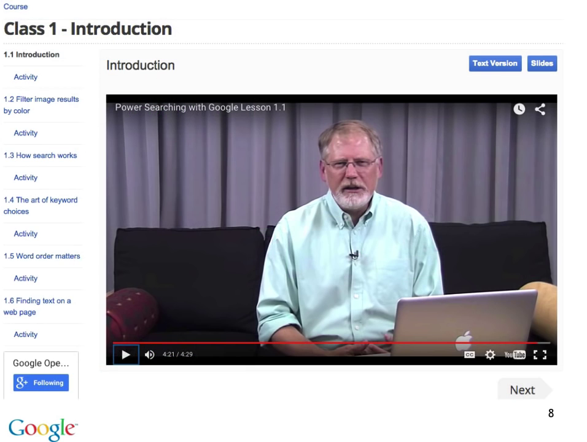

# 1.1 Введение

Привет и добро пожаловать на курс "Эффективный поиск с Google". Меня зовут Дэн Рассел (Dan Russell), я ученый-исследователь в Google. Одна из моих задач - обучать людей эффективному поиску. Об этом и будет этот курс. Мы поговорим о ключевых концепциях поиска. Поговорим о том, что это значит - искать в интернете, поговорим о способах улучшить ваши навыки, и том, что вообще возможно найти.

Этот курс создан с целью сделать из вас следопыта 80 левела. Сделать вас, скажем, в 10 раз умнее или хотя бы научить вас искать в 10 раз эффективнее, чем до начала курса. На протяжении курса мы пройдем ряд уроков, каждый урок посвящен определенной теме. Курс разбит на 6 классов, в каждом классе несколько уроков - от одного до пяти, длиной 5-6 минут. После каждого урока будут задания (activity). Я настоятельно прошу вас выполнять их, ведь так вы практикуетесь и становитесь опытнее. Потратьте несколько минут на задания. Иногда задания просты - достаточно выполнить поиск и ответить на несложные вопросы, иногда предлагается прерваться, пойти на форум и запостить там свои мысли. Я прошу вас выполнять подобные задания.

После первой половины курса (трех первых классов) вас ждет промежуточный тест. Это нужно для того, чтобы понять насколько вы усваиваете материал. В самом конце, после всех шести классов, будет финальный экзамен.

Каждый урок будет видеозаписью, где я рассказываю тему. После каждого видео вы увидите задание. В правом верхнем углу вы найдете ссылку на текстовую версию и слайды урока. Если вам так удобнее - нажимайте ссылку и вперед. В правом нижнем углу есть кнопка Next (Дальше), которая откроет задание или следующий урок, если задания нет.

Что важно на этом курсе? Действительно важно только то, что вы учитесь искать эффективно. Это то, чего хотел бы я и, надеюсь, хотите вы. Но если ваша цель - получить сертификат, то значение имеют только промежуточный тест и экзамен. Но как я уже говорил - выполняйте задания, они важны.

Я также призываю вас пользоваться форумами, участвовать в обсуждениях, посвященных урокам. Иногда заданием будет пойти и написать что-то на форуме. Сделайте это. Вы научитесь большему участвуя в дискуссиях. Это глобальный курс и социальный аспект обучения оказывается очень важен. Иногда вы помогаете своим сокурсникам, иногда учитесь у них. Помните об этом при прохождении курса.

Имейте в виду, что не все функции поиска, которые я покажу при прохождении курса, доступны повсеместно. Иногда мы ограничены требованиями законодательства некоторых стран и тому подобным. Позже мы перечислим дополнительные видео, которые расскажут как получить доступ ко всем функциям, даже если в вашей стране доступны не все из демонстрируемых в курсе. Такое иногда случается.

Ключевая мысль всего курса в том, что поиск - это навык, которому можно научиться и прокачать его. Многие наши сервисы в интернете, используют одни и те же базовые концепции поиска. Одна из них - использовать правильные запросы. Другая идея - уменьшить область поиска, чтобы получить именно то, что ищите. Еще одна - использовать все эти навыки во всех продуктах Google. У нас есть YouTube, у нас есть Картинки, есть Карты, Патенты. Все эти навыки могут использоваться в разных областях.

"Эффективный поиск" по настоящему глобальный курс. Вашими однокурсниками будут люди со всей планеты. Пользуйтесь этим. Вы увидите, что мир огромен и результаты поиска, полученные из разных мест, часто могут быть очень интересны. Например, вы можете поискать [Google Senegal] или [Google Costa Rica] и найдете локальные версии Google для этих стран.

Теперь я хочу обратить ваше внимание на текст в квадратных скобках, например [Google Senegal]. Это пример запроса. Каждый раз, когда видите текст в квадратных скобках, это запрос. То, что вы вбиваете в Google. Не набирайте скобки. Вы можете, конечно, но они не будут учитываться. Скобки используются просто чтобы выделить границы запроса.

Наш следующий урок будет посвящен клёвому методу фильтрации по цвету, и, в целом, базовому навыку фильтрации поисковой выдачи для получения более точных результатов. Но перед этим я прошу вас перейти к заданию и выполнить его, чтобы влиться в процесс.

Надеюсь, вам понравится курс. Увидимся на следующем уроке.
