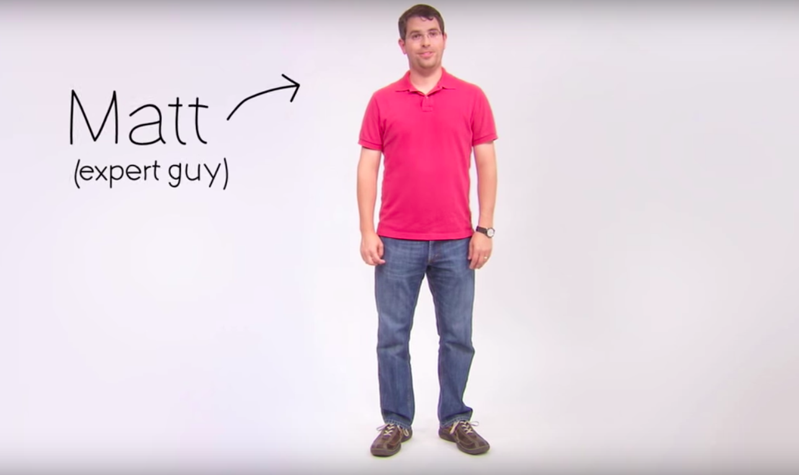

# Как работает поиск

Привет. Меня зовут Мэтт Катс, я инженер отдела качества в Google.
Хочу рассказать, что происходит, когда вы ищете информацию в поиске Google.

Первое, что нужно понять – если вы делаете запрос в поиске Google, вы
не ищете информацию напрямую в интернете. Вы ищете в слепке интернета,
который сделал Google. Точнее, той части интернета, до которой мы смогли добраться.

Мы делаем это с помощью специальных программ, которые называют пауками.
Пауки начинают работу, заходя на несколько страниц в интернете.
Потом они идут по ссылкам, которые найдут на этих страницах и проходят на новые страницы.
На новых страницах они тоже находят ссылки и идут на другие страницы.
И так далее, пока получается найти новые страницы.
В результате получается обойти огромное количество страниц: информация о
миллиардах страниц хранится на тысячах машин.

Предположим, я хочу узнать, как быстро бегает гепард.
Я печатаю поисковый запрос, например "гепард скорость бега" и наживаю на ввод.
Программа поиска начинает искать в слепке каждую страницу, на который
есть эти слова. В данном случае есть сотни тысяч возможных результатов.

Как Google решает, какие документы мне на самом деле нужны?
С помощью анализа страниц по более чем 200 параметрам.
Например, сколько раз эта страница содержит нужное слово?
Ключевые слова входят в заголовок? Ссылку? Слова встречаются друг
рядом с другом? Есть ли на странице синонимы этих слов?
Эта страница с качественного сайта или не очень? Какой у этой страницы PageRank?

PageRank – формула, придуманная основателями Google, Ларри Пейджем и
Сергеем Брином, которая определяет важность страницы по тому, сколько
внешних ссылок есть на эту страницу и насколько эти ссылки важны.

В конце концов, мы совмещаем все эти факторы для подсчёта
рейтинга каждой страницы и показа результатов поиска.
Весь этот процесс занимает примерно полсекунды.

В Google мы очень серьёзно относимся к качеству результатов:
мы стараемся сделать так, чтобы материалы были полезные и полные.
Мы не берём деньги за добавление сайта в наш индекс, ускоренной его индексации
или повышение его рейтинга.

Давайте посмотрим на результаты поиска. У каждого результата есть
заголовок, ссылка и часть текста со страницы. Этого обычно достаточно,
чтобы понять, есть ли на этой странице то, что нужно. Ещё там показываются
ссылки на похожие страницы, ссылку на ту версию страницы, которая есть
в Google и похожие поисковые запросы, которые мне могут быть интересны.

Иногда справа и сверху показываются рекламные объявления. Мы очень серьезно
относимся к нашему рекламному бизнесу, как со стороны рекламодателей так
и со стороны пользователей. Для этого мы показываем только те объявления,
которые вы на самом деле хотите видеть. Будьте внимательны и различайте
рекламу и результат поиска. Наконец, мы не покажем вообще никакой рекламы,
если мы не найдём объявлений, которые по нашему мнению помогают вам
найти нужную информацию.

Кстати, гепард бегает со скоростью больше 110 км/ч.
