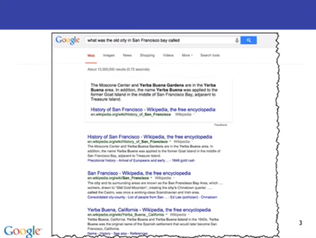
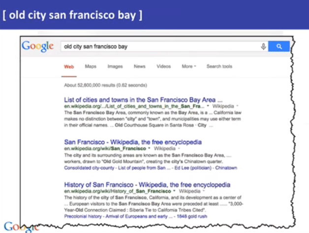
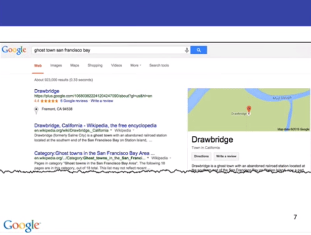
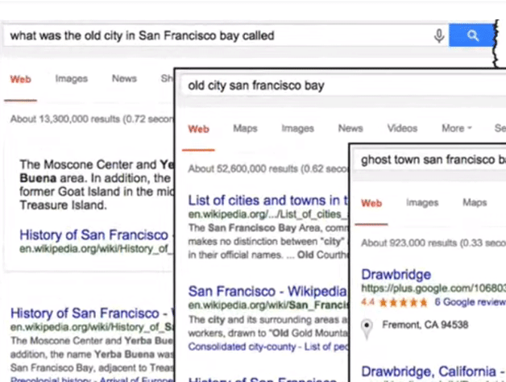
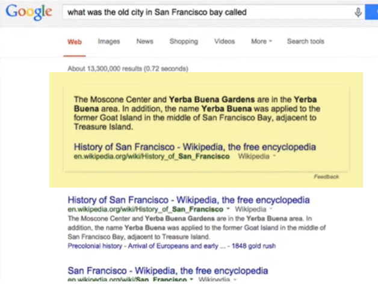

# Искусство выбора ключевых слов

Привет и добро пожаловать. Это урок 1.4, который я называю "Искусство выбора ключевых слов".

Я называю это искусством, потому что не существует какого-то сборника ответов с правильными решениями.
Здесь придётся каждый раз немного поразмыслить. Об этом я и хочу поговорить в сегодняшнем уроке.
Когда вы общаетесь с Гуглом, когда задаёте вопросы - нужно хорошо подумать о том, какие слова вы хотите использовать.
Этот урок как раз о том, как выбрать эти слова. Поэтому он и называется - "Искусство выбора".

Есть три вещи, о которых вы должны знать:

1. Подумайте о том, что вы пытаетесь найти.
Я имею в виду — не спешите писать в строку поиска любые слова, которые приходят вам в голову.
Я встречаю огромное количество людей, которые просто вводят самые первые слова, пришедшие на ум.
Не делайте так. Вместо этого подумайте - какие слова важны, а без каких можно обойтись?
Какие понятия являются наиболее существенными, ключевыми для той вещи, которую вы пытаетесь найти?
Один из способов сделать это - попробовать вообразить слова, которые будут находиться на странице.

2. Выбирайте слова, которые по-вашему мнению будут упомянуты на странице с результатом.
Подумайте об этом так: вы пытаетесь найти страницу, или две, или три, которые существуют
где-то во всемирной паутине. Какие слова будут написаны на этих страницах?
Как бы автор описал и что сказал про вещь, которую вы пытаетесь найти?

3. Представьте себя на месте автора нужной вам веб-страницы.
Какие бы слова он использовал?
Приведу пример - если вы пытаетесь найти информацию о том, как лечить перелом руки, то, скорее всего,  вы не захотите
использовать для поиска запрос  **busted arm** (*сленг, примерно = поломанная рука*). Да, это хорошо описывает произошедшее,
но скорее всего так пишут люди, которые общаются неформально.

И если у вас сломана рука - это не те слова, которые вам нужны.
Какие слова употребил бы человек, совет которого вы бы хотели прочесть? Как написал бы врач?
Скорее всего, вы воспользуетесь запросом **broken arm** (сломанная рука), или даже **bone fracture** (перелом кости)
или другими медицинскими терминами.

Вот задача, с которой я недавно столкнулся:
Кто-то сказал мне - "Я слышал, что существовал какой-то старинный город в заливе Сан-Франциско. Как он назывался?"
Текст далее - это то, что сразу же приходит на ум, когда хочется как можно быстрее написать запрос:
**what was the old city in San Francisco bay called** (как назывался старый город в заливе Сан-Франциско?)
Если вы введёте этот запрос в Гугл, вот, что вы увидите:

Это довольно интересно, потому что в самом начале страницы можно увидеть небольшую вставку. Это ответ, который был взят
с какого-то сайта из результатов. Там указана  правдивая информация, но это не совсем ответ на вопрос, который я ищу.

Здесь упущен результат, который я на самом деле хочу отыскать. Потому что тот человек сказал мне - это не просто старый город,
это не предыдущее название Сан-Франциско,это какой-то небольшой заброшенный городок или деревня, что-то типа того.
Поэтому результат поиска и не передал мою идею. Кроме того, когда вы пишете запрос в вопросительной форме - он обрабатывается
слегка иначе, чем обычно. Мы вернёмся к этому чуть позже, а пока обратите внимание, что в нашем запросе очень много лишних слов.
Как нам убрать эти слова? Как оставить самую суть того, что мы хотим найти?

Мы можем перефразировать предложение и попробовать запрос **old city san francisco bay** (старый город залив Сан-Франциско).
Мы выбросили все лишние слова и оставили только те, которые, как мы думаем, будут на странице, точно
описывающей нужный нам результат.

Результаты стали уже немного лучше:

Теперь у нас есть список городов в заливе, статья из Википедии, статья об истории Сан-Франциско.

Но всё-таки мы ещё не нашли именно то, что хотим. В такие моменты нужно остановиться и подумать - что ещё я могу сказать о своём вопросе?
Как я могу его сформулировать? Подумайте вот о чём - как называют старинные или заброшенные города?
О, я знаю - города-признаки. Давайте проверим! Давайте используем это сочетание в запросе
**ghost town San Francisco bay** (город-призрак залив Сан-Франциско). Я использую специальный термин - город-признак.
Это редко используемое сочетание, и оно прекрасно описывает именно то, что мы ищем.

И посмотрите на это:

Это отличный результат. Самая первая ссылка - страница на сервисе Google+ о городе Drawbridge (Дробридж).
И если вы почитаете статью на Википедии о этом городе (который раньше назывался Салин Сити (Saline City)),
то узнаете, что это город-призрак с заброшенной железнодорожной станцией, и это именно то, что нам нужно!

Как видите подбирая правильные слова, которые, скорее всего, окажутся на желаемой странице, мы можем найти именно такую страницу.

Давайте сравним эти три разных запроса

Первый запрос **what was the old city in San Francisco bay called**,
против второго **old city san francisco bay**, против заключительного **ghost town San Francisco bay**

Вы видите, что результаты отличаются в каждом случае. Поэтому ваша задача как опытного пользователя гугла - это найти такие слова,
которые дадут вам желаемый ответ.

Я хочу обратить внимание на одну вещь - мы убирали слова и оставили только самую суть вопроса.

Стоит заметить, что в первом запросе, который мы делали **what was the old city in San Francisco bay called**
в самом начале страницы была вставка с кратким ответом. (я выделил её жёлтым цветом для наглядности)

Иногда, когда вы задаёте вопрос Гуглу, он пытается найти ответ и сразу показать его вам.
Это функция, над которой мы работаем сейчас, и она становится всё лучше и лучше. Она называется "question answering (вопросно-ответная система)"
Пока нельзя полагаться на неё постоянно. Некоторые вопросы она ещё не обрабатывает, но на некоторые отвечает крайне хорошо.
В нашем случае эта система не выдала нам точный ответ, который мы хотели, потому что мы не пояснили нашу цель достаточно чётко.
Её результат это очень подходящий ответ на наш вопрос. Просто так получилось, что мы искали информацию именно о городе-призраке,
а не о том, как ранее назывался Сан-Франциско

