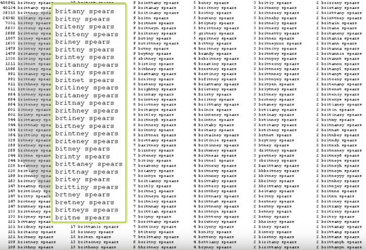

TODO: translate https://coursebuilder.withgoogle.com/sample/unit?unit=2&lesson=10

# Порядок слов важен

Давайте поговорим о том, как конкретно вы делаете запрос в поисковую систему.
Дело в том, что при создании запроса вам нужно не только выбрать правильные слова,
но и поставить их в нужном порядке. Давайте об этом и поговорим.

Первое, что стоит запомнить – каждое слово влияет на результат запроса.
Вы не можете напечатать нужный запрос, а потом несколько случайных
слов и ожидать хороших результатов.

Главная мысль этой главы: каждое слово в запросе имеет значение и
порядок слов тоже важен. Давайте посмотрим на пример.

## Добавление слов в запрос

Если мы сделаем запрос "who", то получим результаты о World Health Organisation.
В английском языке артикль многое значит, поэтому давайте попробуем
сделать запрос "a who". Теперь они посвящены фильму "Horton Hears a Who",
потому что наш запрос – часть названия этого произведения.
Давайте попробуем сделать запрос с другим артиклем, "the who".
Результат опять изменился, теперь он посвящён музыкальной группе с таким названием.
Как видите, добавление даже артиклей приводит к иным результатам.

## Изменение порядка слов

Давайте посмотрим на это с другой стороны. Сделаем запрос "sky blue".
В результате мы увидим фотографии голубого неба и статью на Википедии о том,
почему небо голубое. Давайте переставим слова местами и сделаем запрос "blue sky".
Теперь мы видим информацию о студии Blue Sky, ресторане и других заведений
с таким же названием.

## Что не важно при запросе в поиск Google

Многие вещи имеют значение при поисковом запросе, а некоторые – нет.
Это тоже важно знать. Регистр букв не имеет значения. Запросы "Iphone",
"iPhone" и "iphone" выдадут одинаковые результаты.

Ещё одна вещь, которая не важна в запросе – специальные символы,
которые мы используем, но которые не могут быть найдены через Google.
Например, символ раздела, параграфа, иены, фунта, евро. Вы можете
вставить их в поисковый запрос, но поиск проигнорирует их. Так что
важно понимать, что работает, а что нет.

С другой стороны, некоторые специальные символы всё же имеют значение
для поиска. Например, `C++` и `C#` – это название языков программирования.
Решётка перед словом (`#hastag`) позволяет искать хештеги во всём интернете.
Некоторые другие символы (например, `$`, `@` или `%`)
могут быть распознаны, когда используются в контексте. Так что если вы,
например, ищете цену товара в долларах, соответствующий знак будет
распознан верно.

## Система исправления опечаток

Ещё одна важная делать – у поиска Google отличная система исправления
опечаток и неточностей написания. Вот, например, список возможных
способов ошибиться в написании имени Britney Spears:

Давайте для примера сделаем запрос с опечаткой: `brittney spears`.
В результате мы увидим список результатов, посвящённый Britney Spears.
Это произошло потому что Google распознал ошибку и показал верные результаты.
Сразу под поисковой строкой он сообщил об этом и предложил посмотреть результаты по изначальной версии запроса.
Если мы последуем по этой ссылке, то увидим результат поиска
по исходному запросу без исправления (`brittney spears`):
фотографии Бритни Спирс (потому что много других людей опечатывались,
размещая фотографии) и информацию о людях с именем Brittney (с двумя t).

## Итого

Когда вы делаете запрос в поиск Google, вы должны помнить, что:

- порядок слов важен,
- некоторые символы нельзя искать,
- исправление опечаток может помочь во многих случаях,
- иногда маленькие слова (a, an, the) могут сильно изменить результат поиска.
