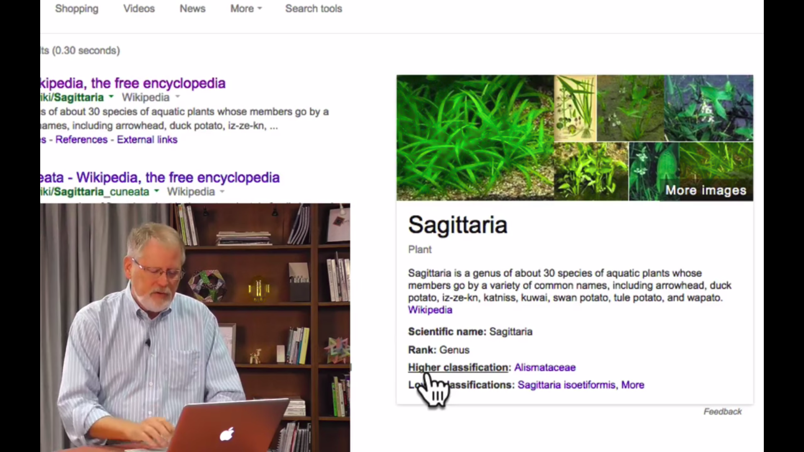
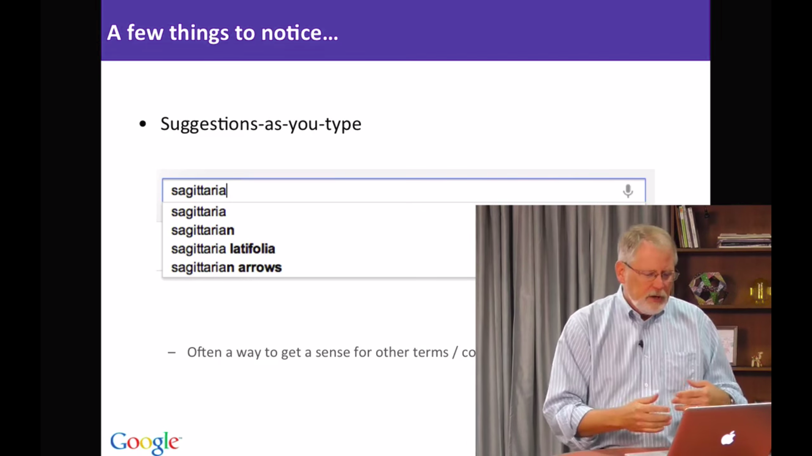
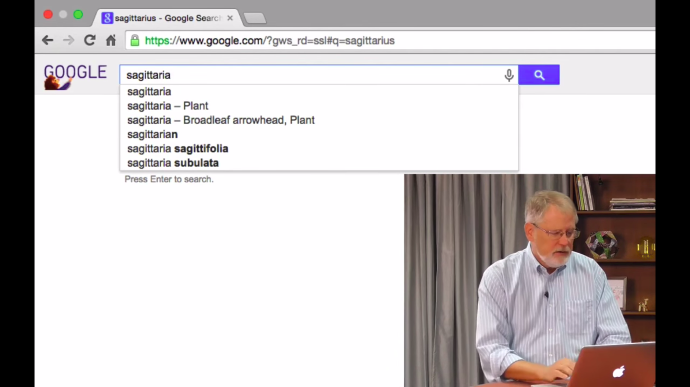
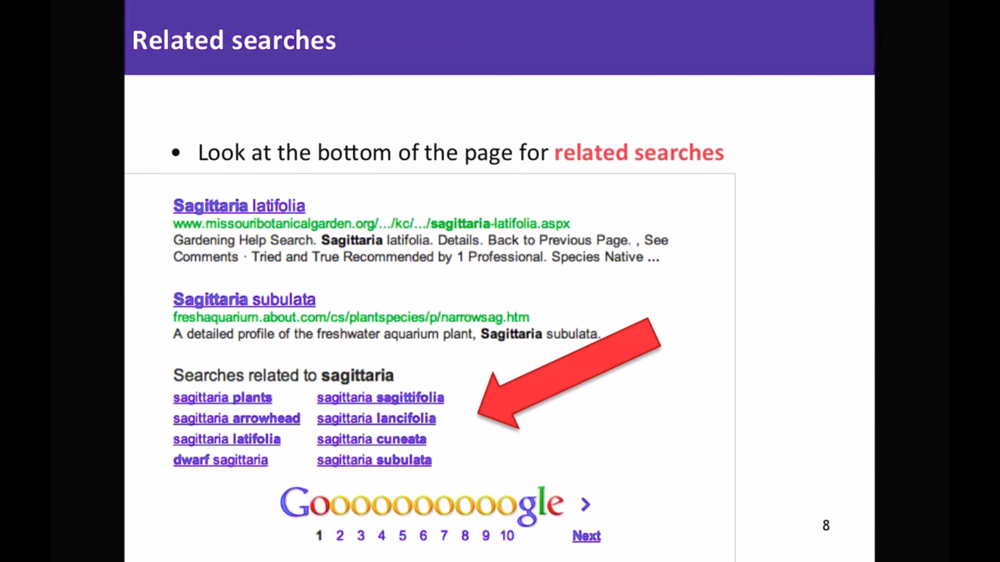
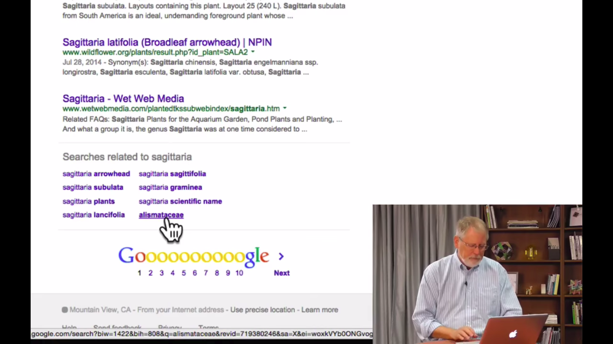

# 2.1 Рекомендации, поиск при наборе, панели знаний.

Google действительно хорош не только в поиске информации, но и поиске дополнительной информации, которая поможет вам правильнее сформулировать запрос. Эта дополнительная информация может быть невероятно полезной. Как вы можете видеть, иногда результаты поиска дают вам немного больше, чем вы просили. Действительно, слева как обычно синие ссылки, но здесь, с правой стороны у нас есть то, что назвается панелью знаний:

В панели знаний распологается дополнительная информация, которую мы знаем об этой сущности. В этом случае я сделал поиск "Sagittaria", это вид водяных растений. И здесь, на правой стороне, Google предоставил панель знаний. В ней та информация, которую мы знаем об этой сущности, в этом случае о растении: его научное название, его классификаця, его ранг и так далее. Google предоставляет вам панель знаний, чтобы помочь вашему поиску. Вы можете не только кликнуть по картинкам и получить больше изображений, но вы можете также увидеть все эти строки ниже, в данном случае вы видите научное название, ранг - и все это кликабельные элементы. 
Если я хочу узнать больше о, например, ранге, то я могу нажать на него. Google говорит мне, что Sagittaria это растения, которые являются членами более крупной семьи Alismataceae. Теперь вы уловили смысл: вы можете построить поиск вокруг этого пространства дополнительной информации, чтобы быстрее найти то, что ищете.

Есть еще несколько вещей, о которых стоит упомянуть. Например, вы можете заметить как Google пытается дать вам некоторые предложения или дописать запрос за вас прямо пока вы печатаете. Например, здесь я начал набирать "Sagittaria" но под окном поиска есть несколько других вариантов, например, "Sagittaria latifolia", это полное латинское название и "Sagittarian arrows"(стрелы стрельца, знака Зодиака). То, что вы видите - это другие способы, которыми люди могли бы завершить то, что вы набираете. Это действительно удобно, потому что это не только позволяет печатать более быстро, но также дает вам представление о том во что этот префикс, эти буквы, которые вы набрали, могут быть расширены.

Снова рассмотрим на примере. Вот я печатаю "sagitt" и вот "sagittarius" - это наиболее вероятное завершение этого запроса. Допишем до "sagittaria" и теперь, когда я набрал всё латинское название этого растения - предлагаются другие варианты. В этом случае предлагается Sagittaria как растение, Sagittaria - широколистная, особый вид растения, Sagittarian (стрелец, знак Зодиака) все еще предлагается и так далее. Вы видите что он пытается сделать? Google пытается воспользоваться всеми другими запросами что люди во всем мире сделали до сих пор и вы можете увидеть среди них тот, который вы действительно хотите сделать. Это очень удобно, особенно если вы не можете или не умеете хорошо печатать. Это отличный способ помочь вам добраться до запроса, который вы действительно хотите, так быстро, как возможно.

Теперь одна из вещей, которая может произойти, когда вы ищете. Вы можете встретиться с тем, что называется "искать по мере ввода" или Google Instant. Это когда вы ищете слово и Google начнает заполнять результаты за ваc по мере того как вы набираете. Это интересно, потому что иногда позволяет найти то, что вы не знаете как искать, к чему вы не можете сформулировать запрос. Например, предположим, что я ищу книгу об апельсинах от шотландского автора. И я не знаю, как это спросить у Google правильно. Вы можете сказать, шотландский автор, книга о апельсинах - это же безумие, никто не будет такое искать. Но иногда я действительно не знаю как мне искать и намеренно пользуюсь преимуществами Google Instant.

Я собираюсь начать набрав "oranges book". Я ещё не нажал Enter, но Google уже заполнил кучу результатов основанных на том, что я успел набрать. Итак, вы можете увидеть ниже, что Google предложил автозавершения. Это другие вещи, которые другие люди набрали. Другие запросы, которые они сделали когда-то. Google уже заполнил результаты, и вот самый первый пункт - "Апельсины", написанная Джоном Макфи. Я знаю, что Джон Макфи - американский автор, но у него шотландское имя, поэтому посмотрите что случилось, я нашёл ответ на мой запрос: шотландский автор, книга об апельсинах, нет другого способа сделать это легко.

Итак, итог. Пока вы вводите - предложения немедленно появляются сразу под запросом. Также при вводе Google Instant заполнит результаты запроса ниже, чтобы вы получили два дополнительных фрагмента контекстной информации. Другие способы заполнения этого запроса, другие пути того, какие результаты могут удовлетворить ваш запрос. Так что это действительно удобно, потому что иногда, если вы не уверены что вы ищете, например, шотландского автора, которого вы можете узнать только увидев его в результатах поиска - это очень легкий способ поиска. 

Что еще я хочу отметить, что у нас есть то, что называется "связанные запросы" в нижней части страницы. Похожие запросы - это просто запросы, которые сделали другие люди по этой теме, но не обязательно точно то, что вы набрали. Причина, почему это очень удобно, в том, что вас вытащат из вашей концептуальной коробки, что даст вам другие идеи о путях поиска через связанные с этим термины или концепции.

Позвольте мне показать вам это на примере снова: мы вводим запрос "Sagittaria" и вы видите результаты, которые мы видели и прежде. Теперь я прокручу весь путь к низу страницы и увижу здесь запросы, связанные с Sagittario. Это стопка из нескольких запросов, в том числе того, который мы теперь знаем, - это имя семейства для этого растения. Но заметьте, оно нигде не содержит "Sagittaria", так что это связанная концепция или связанный запрос. Снова невероятно полезно для открытия новых горизонтов.

Здесь вы видите, что Google давает вам дополнительные способы посмотреть информацию более широко, более контекстуально, чем вы могли подумать. У нас есть советы или предложения, автозавершения, у нас есть "связанные запросы", которые мы только что видели, у нас есть мгновенный поиск в фоне и у нас есть панель знаний на правой стороне страницы. Это все невероятно полезно для расширения горизонтов по теме, что вы ищете.

Удачи!
