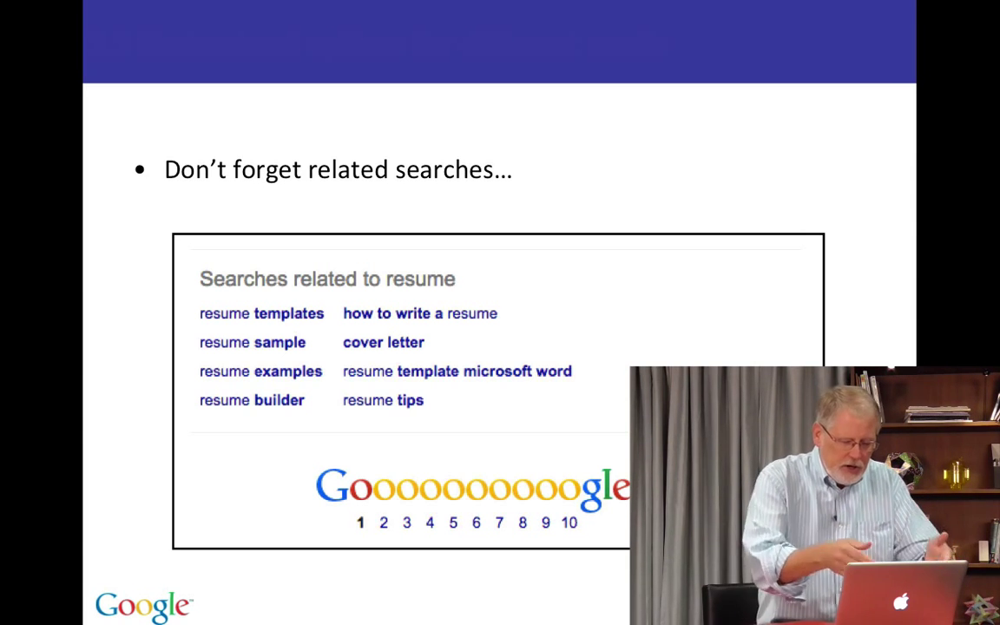
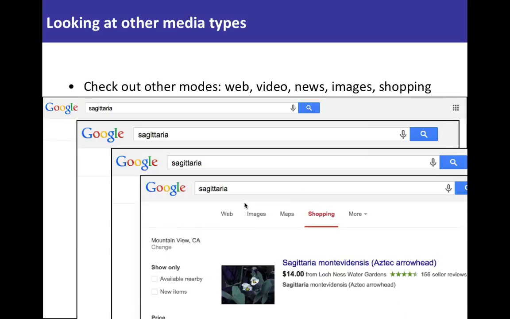

# 2.3 Разбираемся с разными видами результатов

Что вы точно знаете об интернете и о поиске с Google, так это то, что в сети куча всякого разного - веб-страницы, картинки, видео, тысячи их. В этом уроке вы узнаете, что иногда вам следует обратить внимание на варианты, о которых вы обычно даже не думаете.

Как вы видите, Google выдает гору разного контента. Мы стараемся смешивать разные типы результатов на странице результатов поиска. Это набор результатов по запросу __resume__ (резюме).

В центре вы видите набор картинок, которые мы сгруппировали вместе и расположили в середине страницы. Это подсказывает вам, что возможно следует искать не только веб-страницы. Я имею в виду, что иногда посмотрев чуть дальше обычных веб-страниц, вы получите полезные результаты по вашему запросу.

Еще одна полезная штука - часто внизу страницы находятся ссылки, которые мы называем "связанные запросы".

Здесь мы видим "шаблоны резюме", "примеры резюме", "советы", "сопроводительное письмо" и т.д. Здесь также предложения, как по другому может звучать ваш запрос.

Основная мысль этого урока в том, что существуют и другие виды результатов.

Например, когда вы ищете __resume__ вы думаете что-то вроде "Так, мне надо найти веб-страницы о резюме и о том, как создать резюме". Но на самом деле, если вы взглянете на картинки с резюме вы обнаружите огромное количество различных результатов, которые могут быть интересны.

Теперь глянем что было бы, если бы мы выполнили поиск по запросу __resume__ и щелкнули наверху по вкладке Картинки.

Наверху прокручивающийся список картинок, сгруппированных по смыслу - примеры резюме, шаблоны, резюме для работы и т.д. Мы не только показываем вам картинки с резюме, но также ищем группы похожих картинок, на которые вы возможно захотите кликнуть. Ниже находится множество картинок подходящих под запрос.

Иногда поиск по картинкам это именно то, что нужно.

Помните, что это также справедливо и для других запросов.

Вспомните наш запрос __sagittaria__, вид растения, который мы искали раньше. Я выполнил обычный веб-поиск и вы видете результаты, такие же как раньше.

Но предположим, что мы ищем видео по запросу __sagittariа__ - да, есть видео об этом растении, видео о том как посадить это растение в аквариуме и т.д.

Есть новости по этой теме. Какие-нибудь свежие данные о том, как влияет разрастание этого растения на экологию.

Есть даже Покупки, потому что иногда вы хотите купить растение.

Я не говорю о том, что какие-то результаты лучше, чем другие, а что иногда просматривая другие типы результатов наткнетесь на неожиданную идею по интересующей теме.

Приведу еще пример.

Предположим, у меня вопрос типа __how to replace my bike chain__ (как заменить велосипедную цепь). Вот результаты по запросу, но заметьте, что самые первые два результата - это видео, и если мы нажмем на вкладку Видео вы увидете еще кучу разных видеороликов.

Иногда полезно взглянуть на различные видео-результаты, чтобы посмотреть процесс с разных сторон, например.

Еще пример - __how to cook a pizza__ (как готовить пиццу).

Мы видим рекламу вверху страницы, реценты, информацию с веб-страниц, картинки - мы хотим показать, что есть множество данных по этому запросу.

Но если мы нажмем на Видео, то скорее всего здесь будут сотни видеорецептов о приготовлении пиццы.

Множество товаров так или иначе связанных с пиццей.

И естественно миллионы картинок.

Даже для простых запросов "Как сделать?.." бывает полезно просмотреть картинки, видео и прочее.

Помните, что иногда выходя за рамки привычного, вы получаете интересные результаты.

Ваше следующее здание - проверить другие результаты поиска, потому что там много вкусного.
