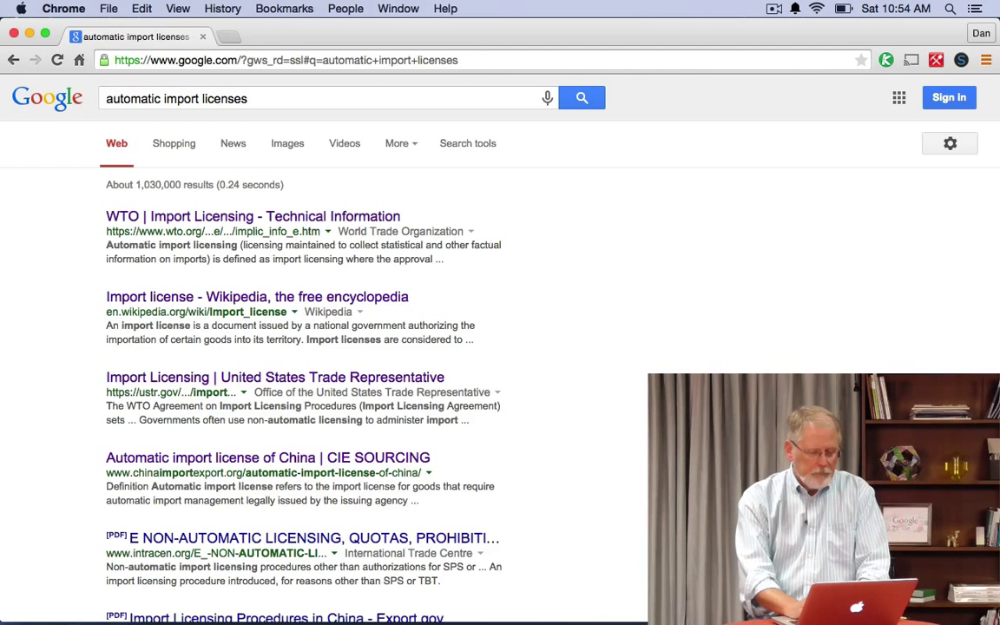

# 2.4 Читаем страницу результатов

Я знаю, вы умеете читать. Но умеете ли вы читать страницу результатов поиска? Когда вы делаете запрос в Google, вы получаете в ответ то, что мы называем СРП - страница результатов поиска.

Вот как она выглядит. Это десять результатов, начиная с самого верхнего, самого первого, который мы считаем самым подходящим ответом на запрос. Второй чуть менее подходящим, третий - еще меньше, и т.д.

В этом уроке я хочу научить вас читать страницу результатов. Это не просто страница с кусками текста. И текст этот не написан человеком. Это кое-что более сложное. Я хочу дать вам этот небольшой навык - чтение результатов поиска.

Как вы видете - СРП это сгенерированный ответ на ваш запрос. Мне выдали задачу - разобраться с автоматическими лицензиями на импорт из Аргентины.

Я начал просто с запроса __automatic import licenses__ (автоматические лицензии на импорт), потому что не очень представляю себе, что это такое. Думаю также, как и вы. Так что сначала я хочу понять, что это вообще такое.

Если вы просмотрите первые несколько результатов, вы увидите ссылку на Википедию, какие-то документы с сайтов разных торговых и государственных организаций. Я открою эти ссылки в новых вкладках, все одновременно, и пройдусь по ним, быстро просканирую их, чтобы получить понимание, что такое automatic import licenses. Это быстрый способ составить предвставление об интересующей вас теме.

Но в данном случае меня интересует Аргентина. Я изменю запрос на __argentina automatic import licenses__ и посмотрю, что специфичного в линцензиях на импорт из Аргентины. После получения результатов я понимаю, что это торговый вопрос, касется государственного регулирования торговли. Я могу поменят запрос, чтобы узнать еще больше (еще глубже)

Но это урок о том, как читать страницу результатов поиска. Так что я должен указать вам на кое-какие детали. Обратите внимание на слова выделенные жирным. Я их дополнительно выделил мышкой. Они выделябтся жирным потому что присутствуют в вашем запросе. Слова из запроса присутствующие в куске текста всегда будут выделенны жирным, чтобы вам было легче их найти.

Другая штука - эти три точки. Они называются [эллипсис](https://ru.wikipedia.org/wiki/%D0%AD%D0%BB%D0%BB%D0%B8%D0%BF%D1%81%D0%B8%D1%81). Каждый раз когда вы видите (эллипсис) их, это означает что что-то было выброшено, что-то было удалено из текста.

Еще кое-что интересное - вот эта стрелка указывающая вниз, рядом с Export.Gov. Она расскажет об этом сайте. Давайте попробуем другую страницу, скажем, ustr.gov. Нажмем на стрелку и узнаем, что это за организация. Это быстрый способ понять насколько авторитетен этот искточник. В данном случае организация давно существует, это представитель Американской Торговой Организации, это часть правильтества. Вполне можно доверять. По крайней мере в вопросах торговли.

Еще одно замечание, касаемо эллипсисов. Надо быть внимательным с тем, что удалили, а что оставили. Вот пример. Сделаем запрос __does palo alto allow milk carton recycling__ (разрешена ли переработка картона из-под молока в Пало-Альто). Я хочу понять, могу ли я выкинуть коробки от молока в контейнер с перерабатываемыми отходами. Обратите внимание на эллипсис вот тут. Будьте внимательны, многоточие означает, что часть теста была удалена, чтобы поместиться в превьюху (абстракт). Вы не можете предпологать, что компьютер не удалит что-то важное. Поэтому всегда следует открыть полный текст, чтобы ничего не упустить.

Теперь давай подробнее разберемся с каждым результатом. Как мы видели - синий текст на самом верху - это заголовок страницы. Ниже, зеленый тектс - это адрест страницы (URL). Рядом с ним - имя организации, World Trade Organization. Стрелка справа от организации даст информацию об организации. Ниже находится сниппет (некоторые люди называт абстракт). Это что-то вроде автоматически сгенерированный итог, о чем эта страница. Иногда ниже находятся синие ссылки, которые ведут на страницы этого сайта. Давайте покажу.

Если я поищу __wto__, вы увидите синие ссылки внизу, они являются частью результата. Вверху находится ссылка на главную страницу сайта, а ссылки внизу говорят о том, что есть и другие страницы на этом сайте.

Приведу еще пример. Поищем __WHO__. Как вы помните из предыдущих уроков, WHO - это World Health Organization (Всемирная Организация Здравохранения). Здесь, в дополнение к обычным ссылкам, мы приводим ссылки на основый разделы сайты, которые часто посещают люди. Строка поиска расположенная над ними, это строка поиска сайта WHO, а не Google. Если я введу __disease__ (болезнь) и нажму Enter, этот запрос будет передан на сайт WHO и будет обработан их поисковым движком.

Чтобы стало еще понятней: __breeds of cats__ (породы кошек). Вопрос, который нас интересует - сколько пород кошек существует? Первый результат предлагает посмотреть на 43 породы кошек. Вы можете решить, что пород всего 43, но давайте спустимся чуть ниже. Вот сниппет говорит, что существет более 200 пород кошек. Сколько же пород на самом деле? Значит, придется покопаться поглубже в этой теме.

Я имею в виду, что иногда кажется, что ответ находится прямо на странице результатов поиска. Что самый первый результат самый верный. Но часто вам нужно почитать сами страницы, что бы найти ответ на свой вопрос.

Теперь вы знаете, как понять, что это за организация, какие разделы сайта люди посещают чаще всего, и как искать на самом этом сайте.
