# 2.5 Различные виды информации

На предыдущих занятиях мы увидели, что с помощью стандартного поиска Гугла можем отыскать огромное количество разных вещей. Мы искали веб-страницы и изображения.
Сейчас я хочу рассказать вам какие ещё возможности есть у гугла.

Иногда мы даже предлагаем специальные интерфейсы, помогающие искать конкретный вид информации.

Вот неполный список вещей, для которых сделаны такие интерфейсы.

* Веб страницы
* Картинки
* Видео
* Академия Гугл (поиск по научным публикациям и судебным решениям)
* Патенты
* Новости
* Книги
* Финансы (котировки валют, акций, новости экономики, информация с бирж и т.д.)

Поиск по веб страницам это основной тип поиска, он позволяет искать любую информацию на веб страницах, ничего необычного.

Если вы выберете вкладку поиска по картинкам, то сможете искать различные изображения и фотографии, тоже ничего необычного.

Поиск по видео поможет отыскать различные видеоролики (включая видео с YouTube).

Но существуют такие варианты поиска, о которых, возможно, вы не слышали.

Например Академия Гугл (Google Scholar) - колекция научной литературы, юридических и научных публикаций.

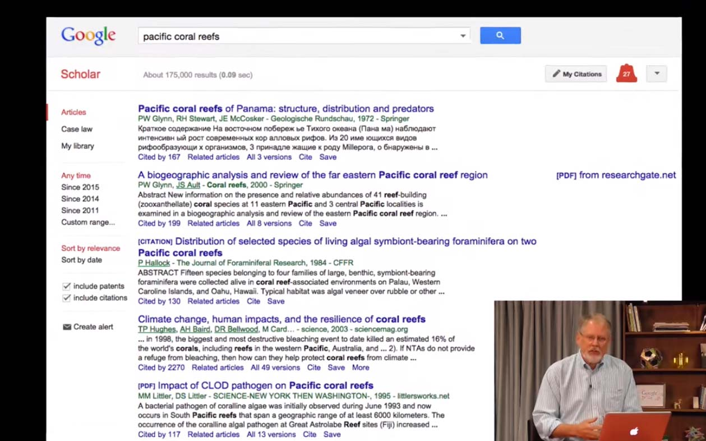

Или Гугл Патенты (Google Patents), которые позволяет искать информацию среди Американских и Европейских патентов.

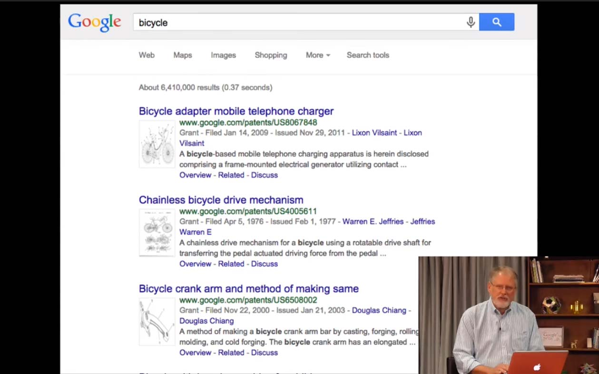

Сейчас я хочу быстро показать вам каждый из этих типов поиска:

Давайте начнём с очень простого поиска. Самый популярный поисковый запрос это "Cats" (Коты).
Мы видим стандартные результаты поиска по веб страницам, а справа у нас есть панель знаний, на которой показана выжимка информации о котах

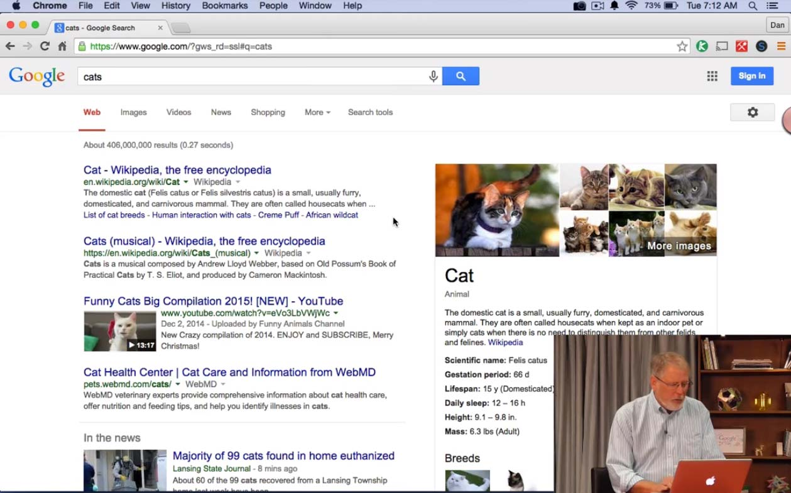

Обратите внимание на верхнюю часть страницы.
Вы увидите вкладку Images (Картинки), про которую уже знаете, Videos (Видео), которая покажет вам различные видео с котами.
(Хочу заметить, что результаты на вкладке Видео - это результаты с разных сайтов, не только с YouTube)
Ещё у нас есть вкладка News (Новости), где собраны все новости о котах, Shopping (Покупки), с товарами для котов.

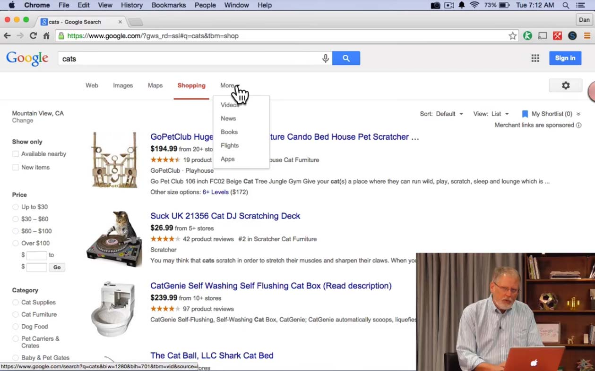

Мы можем нажать на кнопку More (Ещё), которая предлагает перейти в разделы Videos (его мы уже видели)
News (его мы тоже уже видели), а  ещё Books (Книги)

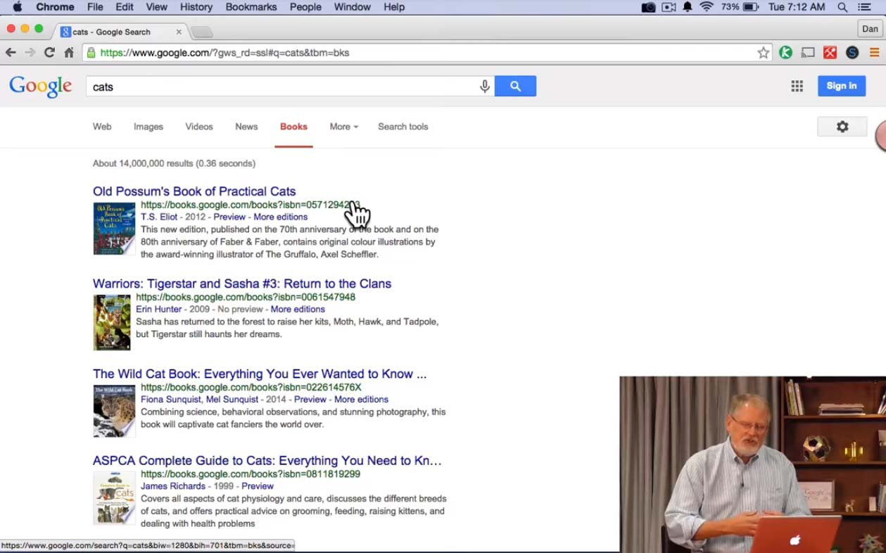

На этой вкладке мы ищем Книги о котах. Гугл Книги (Google Books) это огромная коллекция отсканированных книг, которые мы добавили в нашу базу поиска.
Попасть туда можно нажимая на вкладку "Книги" или вводя в поиске Гугл Книги (Google Books) (что я сейчас и сделаю)

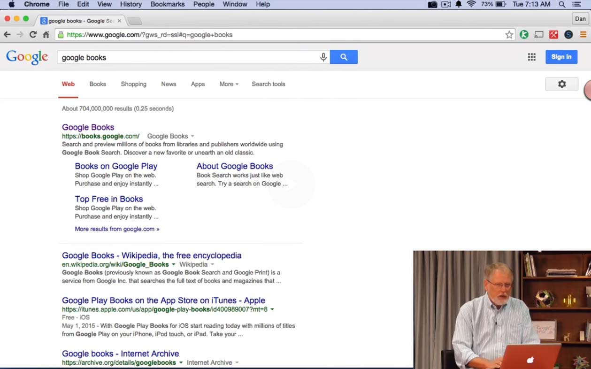

Обратите внимание на то, что я сделал. Иногда разделы Гугл Книги (Google Books) или Гугл патенты (Google Patents) не так-то просто отыскать.

Поэтому я пользуюсь таким трюком постоянно. Я не запоминаю URL адреса. Мне кажется это пустая трата памяти. Вы просто можете поискать "Гугл Книги"  или "Гугл Патенты" или "Академия Гугл" или "Гугл Финансы"

Я нажимаю на первый результат из поиска и появляется специальный интерфейс для поиска книг.

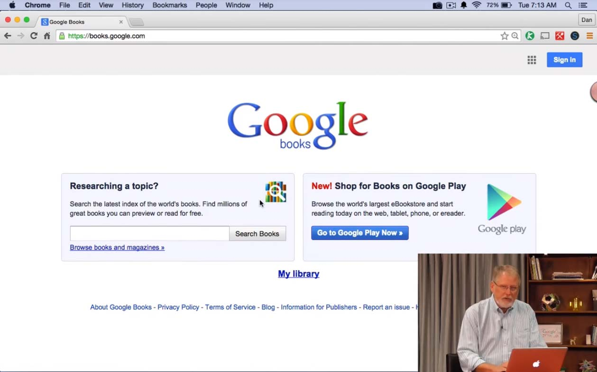

Если я введу здесь запрос Cats, то получу такой-же спискок результатов, что вы видели ранее.

Теперь давайте поговорим немного о Академии Гугл (Google Scholar). Я пишу в поиске "Google scholar", и открываю первый результат.

Так я попадаю на главную  страницу Академии Гугл (Google Scholar).

Теперь я могу вписать свой запрос, и я снова напишу Cats.
Как вы видите здесь большое количество очень сложной и научной информации о котах.

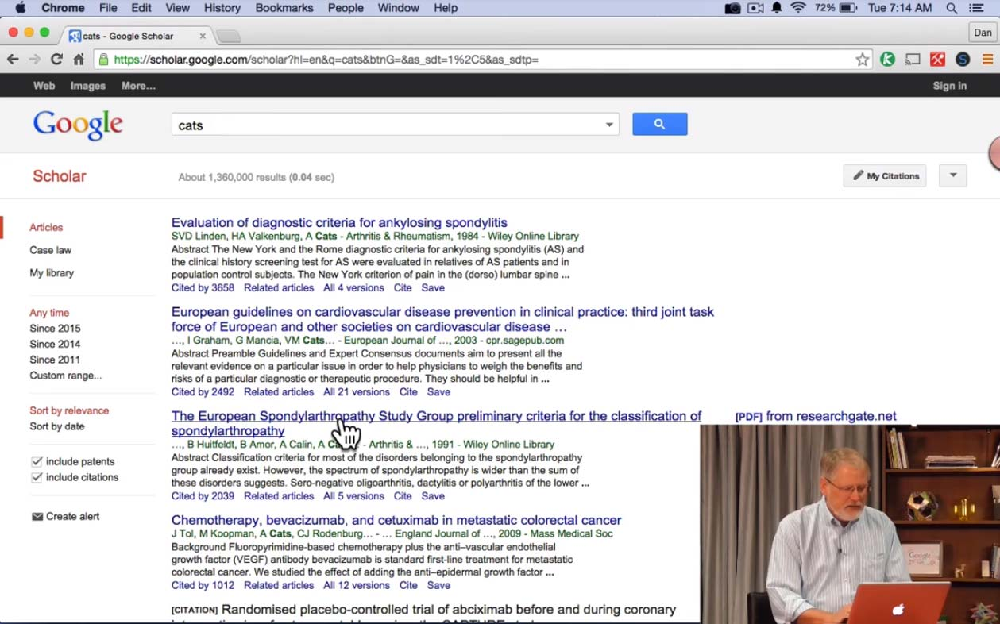

Я не хочу ничего знать об оценке диагностических критериев на анкилозирующий спондилит, но возможно вы захотите.
Гугл найдёт для вас самую разную информацию, а вот трактовать её должны вы сами.

Как я упоминал ранее у нас есть информация о патентах. Как её найти? Я ввожу в поиске Гугл Патенты (Google Patents) и вот мы переходим в этот раздел.

Я снова введу Cats. На странице результатов показываются патенты, связанные с котами. Кликнув на любом из них вы можете просмотреть сам патент.

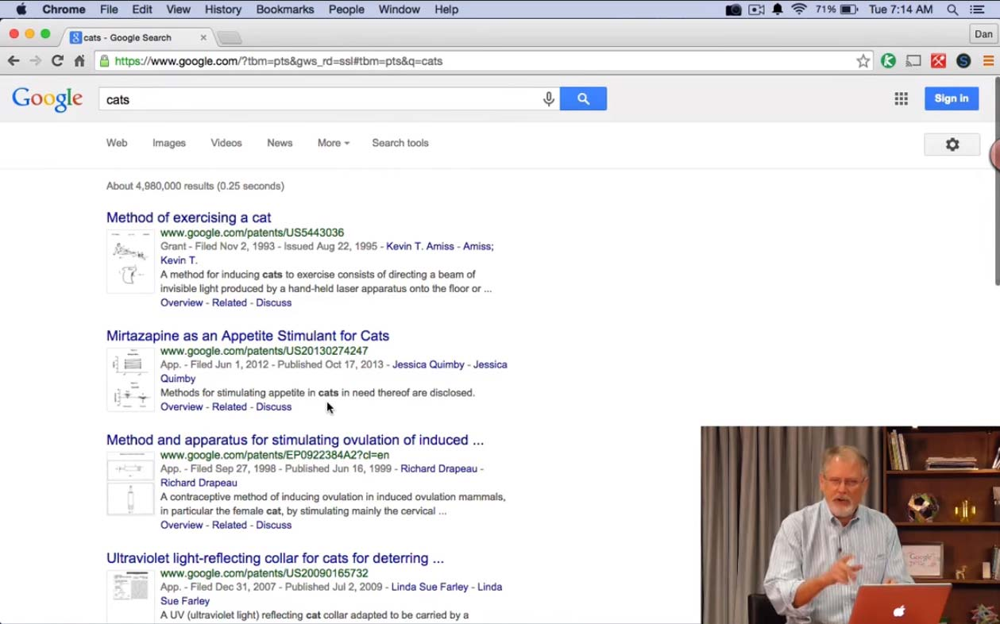

Раздел с патентами содержит все патенты США и недавно мы добавили все патенты Европы.
Я обычно советую использовать расширенный поисковый интерфейс,
поэтому если вы как-то связаны с патентами - жмите на вкладку (Расширенный поиск) Advanced.

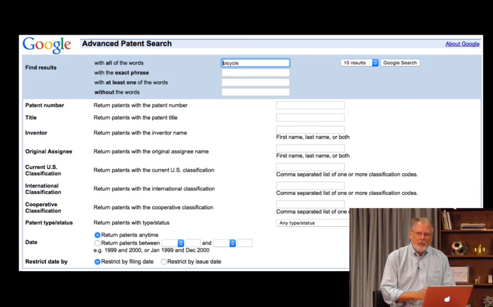

Академия Гугл (Google Scholar) кроме научных публикаций включает в себя множество юридической информаци.
В настоящее время эта информация доступна только на английском языке. Если вы используете русский или другой язык, и хотите ознакомиться с результатами - вам придётся переключиться на английский.

В основном в Академии Гугл (Google Scholar) представлена судебная практика.

Она может быть интересна для тех стран, которые унаследовали судебную систему от Великобритании, в основном это бывшие колони.

Пока у нас в базе присутствуют только правовые заключения и судебные решения США.

Вы можете искать в Гугле что угодно. Не хотите искать котиков? Пожалуйста, вот собачки.

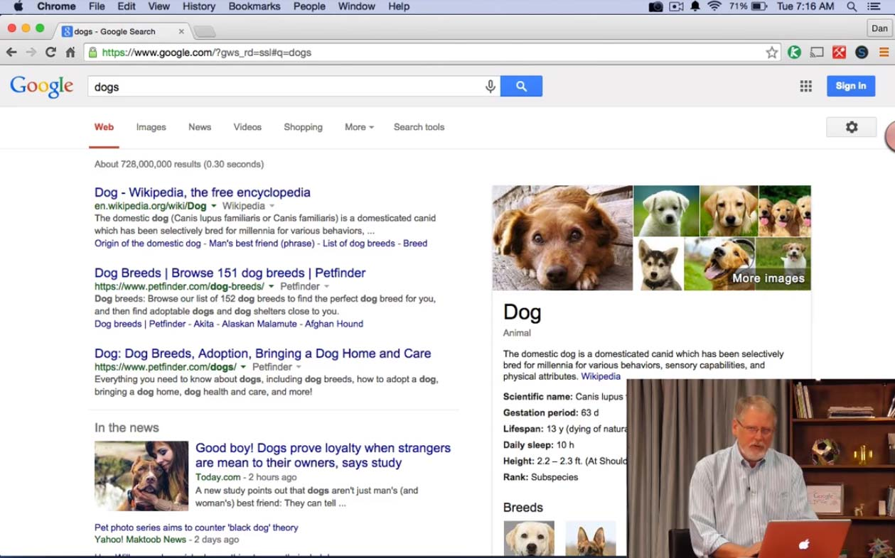

Гугл предоставляет возможности поиска по изображениям, новостям, финансовой информации, юридической информации и так далее.
Главное - это знать о этих возможностях.