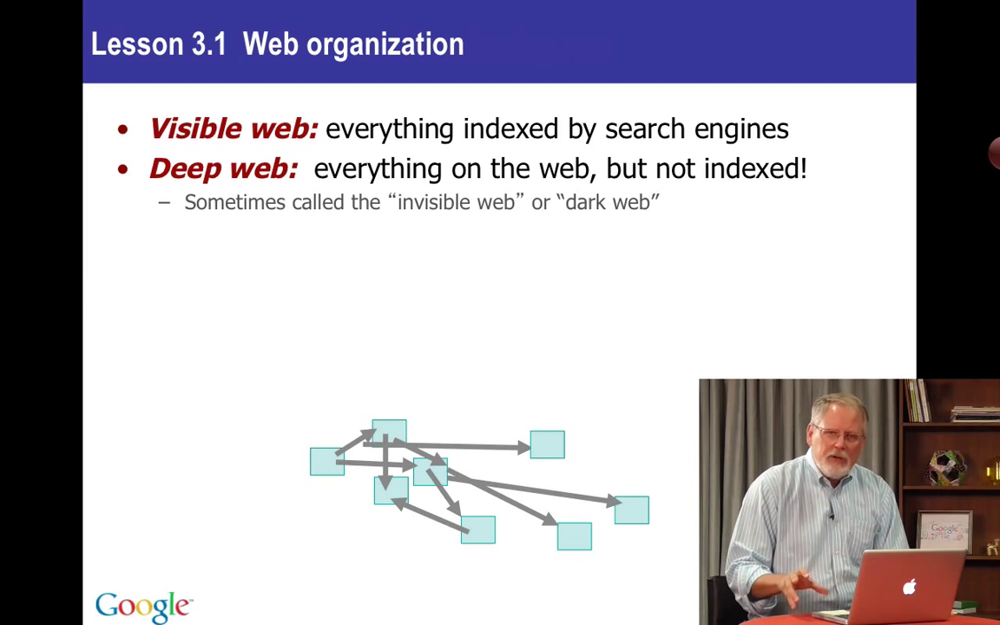
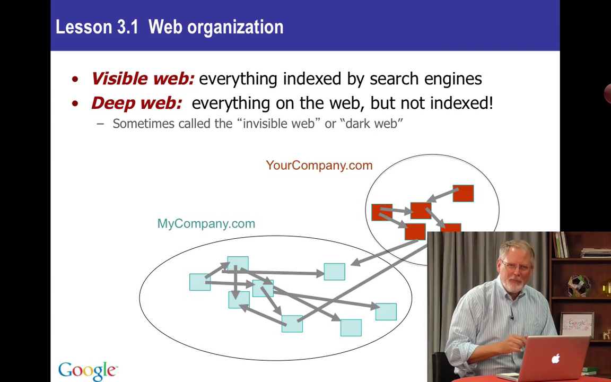
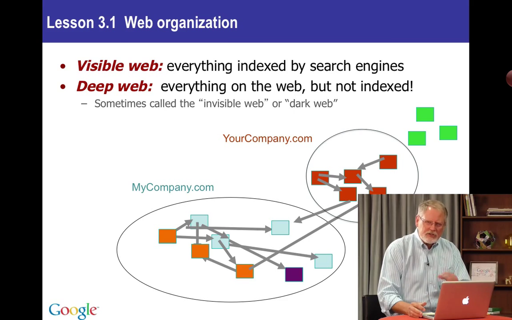
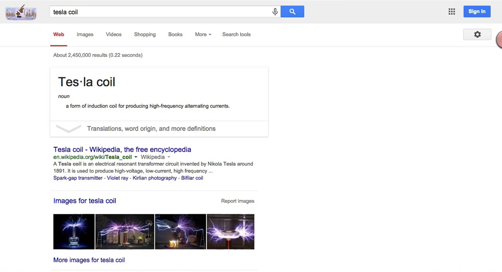
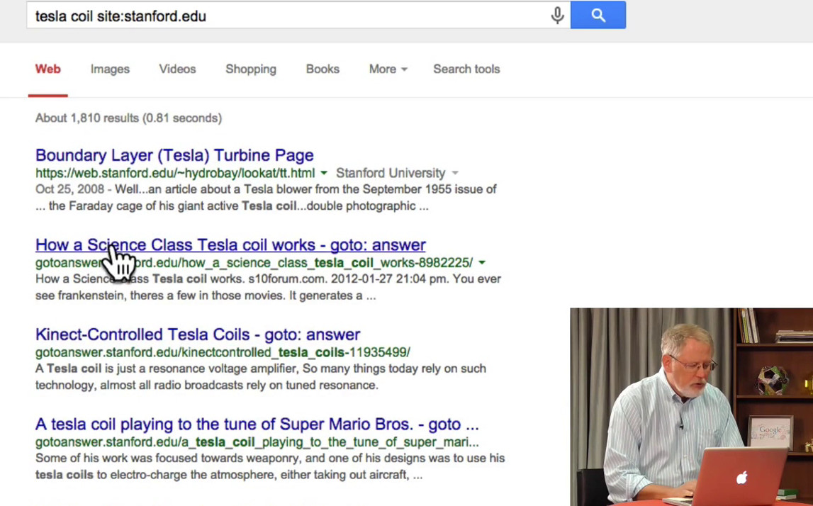

# 3.1 Как устроен Веб и как использовать *site:*

Мы переходим к более продвинутым методам поиска. В этому уроке я расскажу вам про один оператор и о том, как работает Веб. Позже мы рассмотрим и другие операторы, а также научимся пользоваться ими.

## Как устроен Веб

Я начну с того, как организован Веб. Веб - большое беспорядочное место. В его основе страницы (вот эти голубые прямоугольники) и ссылки (стрелки). Когда вы нажимаете на ссылку, вы переходите с одной страницы на другую.

Те данные, которые может собрать Google, мы называем "видимый Веб". Это всё, что можно найти через поиск. Данные, которые найти нельзя, которы не представлены в индексе Google, называются deep web или, иногда, dark web. Это всё то, что мы не можем проиндексировать.

Забив в поиск __business workplace accident rate__ (уровень проишествий на рабочем месте), вы наверняка получите ссылку на страницу данных и статистики OSHA (Управления по охране труда). Если мы откроем эту страницу там будет множество (баз) данных. Мы не индексируем содержимое баз данных. Вместо этого мы предоставляем ссылку на БД и вам придется использовать их интерфейс для доступа к данным. Это часть того самого недоступного Дарк Веба. Т.к. содержимое базы это не веб-станица, мы не можем проиндексировать его.

Страницы в определенном сайте, на определённом веб-сервере, например MyCompany.com - это один домен. Существует огромное множество разных доменов, например, NewYorkTimes.com, Google.com, или Stenford.edu, это всё разные домены. Здесь они показаны кругами со страницами внутри. И ссылки идут уже *между* сайтами. Страница на сайте *MyCompany.com* ссылается на страницу на сайте *YourCompany.com*.

Страницы, которые мы *не* видим (зеленые) - это dark web. Мы никогда не открываем их, они не находятся через обычный поиск Гугл. Важно помнить, что "страницы" бывают разного типа - обычные веб-страницы, картинки, видео и т.д. (это и означают разноцветные квадратики). В будущих уроках я покажу, как найти нужный тип файла, на конкретном сайте, обладающий определёнными свойства. Для этого и предназначены ограничивающие операторы. Давайте поговорим, что это такое.

## Операторы

Операторами мы называем специальные элементы (слова и/или символы), которые добавляются к запросу, чтобы уточнить его. Вот пример: если я делаю запрос __tesla coil__ (катушка Теслы) - это обычный запрос. Потом я кое-что добавляю: __tesla coil site:stanford.edu__. Оператор в данном случае - __site:__. За ним идет аргумент - __stanford.edu__. Существует много операторов, но все они *фильтруют* результаты. У вас есть обычный запрос __tesla coil__, к которому вы добавляете оператор, чтобы как-то отфильтровать (ограничить, уменьшить) результаты.

Вот, что я имею в виду: мы ищем __tesla coil__. Получили почти 2,5 миллиона самых разных результатов.

Но я хочу узнать, что по этой теме есть на сайте *stanford.edu*. Я добавляю оператор __site:__ с аргументом __stanford.edu__ и мы получаем результаты только с сайта Стенфорда - *gotoanswer.stanford.edu*, *web.stanford.edu*, *snf.stanford.edu* и т.д.

Мы можем выполнить поиск, например, только на правительственных сайтах - __tesla coil site:.gov__. Поиск будет производиться только в домене американского правительства *.gov*.

Вот вам секрет - точка на самом деле не нужна. Написав __tesla coil site:gov__, вы получите ровно те же результаты. Но важно не добавлять пробел после __site:__. Сделав запрос __tesla coil site: gov__ вы получите результаты отовсюду - и из домена *.gov*, и *.edu*, и *.com*. Добавление пробела ломает оператор. Поиск просто ищет слово __site__ и слово __gov__. Пробел разрывает взаимосвязь между оператором и аргументом.

Теперь вы знаете как работают ограничивающие операторы. Добавляя оператор __site:__ можно уменьшить количество результатов, чтобы найти именно то, что нужно.

Операторы работают во все продуктах Google. Если выполнить запрос, например, __site:edu mariculture__ (марикультура) и перейти в Картинки, вы увидите картинки только с сайтов *.edu*. Изменим оператор на __site:gov__ - получим картинки только с правительственных сайтов. Перейдем в Новости - получим новости о марикультуре с сайтов .gov.

Это очень мощный оператор, который всегда под рукой. Вероятно, это самый часто используемый мной оператор, потому что я ищу конкретные вещи в конкретных местах. Оператор __site:__ даёт эту возможность и вам.
