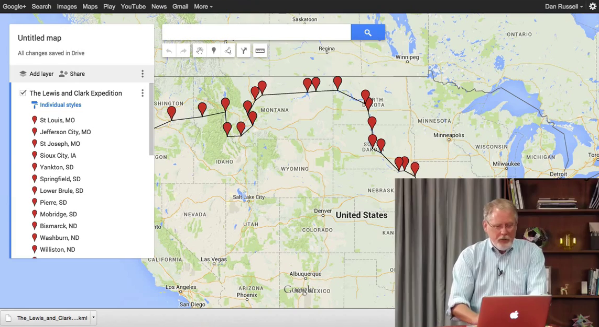
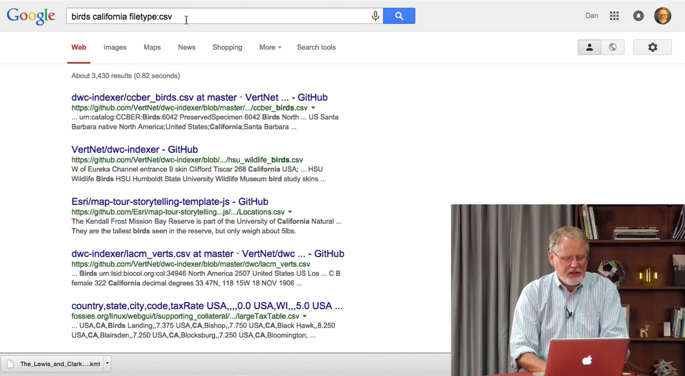

# 3.2 Тип файла

В этом уроке мы узнаем, как отфильтровать результаты поиска по типу файла. В прошлом уроке мы узнали как уменьшить количество результатов используя оператор __site:__, т.е. отфильтровав их по тому, где они расположены в интернете. Сегодня мы научимся фильтровать получаемы результаты по типу документа. Большинство веб-страниц - старые добрые HTML страницы, которые рендерит браузер. Также существует куча других файлов, которые можно найти через поиск. У них есть тип - экселевские таблицы, вордовские документы, текстовые файлы и т.д. Мы можем ограничить количество результатов с оператором __filetype:__, чтобы найти только те файлы, которые нам нужны.

Предположим, я хочу найти информацию об [экспедиции Льюиса и Кларка](https://ru.wikipedia.org/wiki/%D0%AD%D0%BA%D1%81%D0%BF%D0%B5%D0%B4%D0%B8%D1%86%D0%B8%D1%8F_%D0%9B%D1%8C%D1%8E%D0%B8%D1%81%D0%B0_%D0%B8_%D0%9A%D0%BB%D0%B0%D1%80%D0%BA%D0%B0). Запрос будет выглядеть так: __lewis and clark expedition filetype:kml__. Я знаю, что в формате *kml* (или *kmz*) могут храниться данные карт, маршрутов и всякого такого. Я подозреваю, что такой запрос выдаст мне *kml* файл об экспедиции Льюиса и Кларка. Давайте попробуем.

Я скачаю файл по первой ссылке. Это *kml* файл, который можно открыть в Google Earth или в Google Maps. Я забью в поиск __google my maps__ - сервис для создания ваших собственных карт.

Создам новую карту и импортирую данные. И вот оно - полный маршрут экспедиции Льюиса и Кларка. По крайней мере, в одном направлении. Возвращались они чуть по другому пути.

Я думаю, вы уловили суть - используя оператор __filetype:__ я смог найти файл нужного мне типа.

Таким способом можно найти множество различных файлов:

- PDF
- DOC
- DOCX
- PPT
- PTTX
- TXT
- CSV
- DAT
- ...и другие, о которых вы даже не знаете
- KML

Выполним еще один поиск. Я хотел бы найти список птиц, т.е. файл с данными о птицах, обитающих в Калифорнии. Я написал __birds california filetype:csv__. CSV - это один из форматов хранения данных.

Мы получили огромную кучу списков в формате CSV. В частности, самый первый содержит список видов птиц со всей Калифорнии. Круто! Я могу пойти дальше и отфильтровать по другому типу файла, но уверен, что вы уже всё поняли.

Оператор __filetype:__ - еще один инструмент, позволяющий определить тип результата, который вас интересует. Как и __site:__, я часто использую __filetype:__. Оба они позволяют очень точно определить вид документа, который я ищу.

