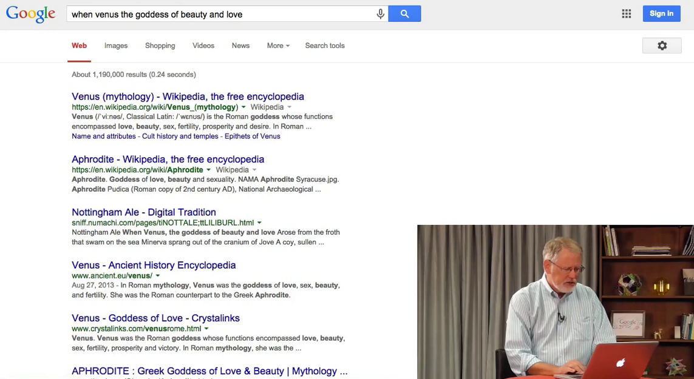
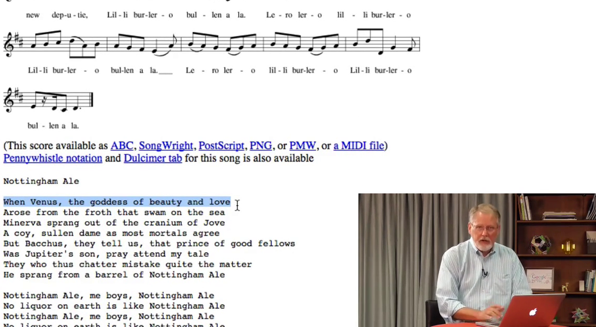

# 3.4 OR и кавычки

При поиске в интернете полезно иметь богатый набор методов и способов, который позволит быстро и точно находить желаемое. В этом уроке мы рассмотрим два новых оператора - оператор __OR__ (ИЛИ) и двойные кавычки. Они позволят еще больше сфокусировать ваши запросы.

## Кавычки

Используйте кавычки (двойные кавычки) когда нужно найти точную фразу. Вот строчка, которая не совсем понятна - __when venus the goddess of beauty and love__ (когда Венера, богиня красоты и любви...). Я знаю, что это слова из старой песни. Давайте поищем её без кавычек.

Куча результатов о Венере, Афродите и т.д., но все не по теме, потому что я ищу конкретную фразу из вполне определенной песни. Я знаю, что фраза верна, так что я добавлю кавычки - __"when venus the goddess of beauty and love"__. Это включает поиск фраз, т.е. поиск именно этих слов именно в таком порядке. Я щелкну на первую ссылку в результатах - и вот слова, которые мы ищем.

Другой пример. Моё имя довольно распространено - Дэниел Рассел. Давайте поищем его.

Видим список результатов (не только обо мне, некоторые из них - да, но далеко не все). Фамилии в некоторых результатах отличаются. Давайте поищем именно мое имя, добавим кавычки, чтобы искать именно эту пару слов - __"Daniel Russell"__.

Результаты уже точнее, это хорошо. Но вот здесь фамилия "Russel", с одной "l":

Чтобы исключить и такие результаты, я добавлю кавычки вокруг одного слова, чтобы искать именно такое написание - __"Daniel "Russell""__ - никаких исправлений опечаток. Так мы получим только нужные результаты с двумя "l".

Кавычки полезны в случаях, когда вам надо найти определенную фразу или конкретное написание одного слова. Но будьте аккуратны, если слово написано неверно, то результаты будут совершенно не те, которые ожидаете.

## Оператор *OR*

Оператор __OR__ (ИЛИ) - единственный оператор, где регистр букв важен - буквы всегда заглавные. Если использовать строчные (or) или смешанные (Or, oR), то они просто добавятся к поиску. У меня есть запрос __"tesla coil" OR "jacobs ladder"__ ("катушка Тесла" ИЛИ "лестница Иакова" (*"лестница Иакова"* - название физического эксперимента, демонстрирующего некоторые свойства электрической дуги - *прим. перев.*)). "Лестница Иакова" - это такая штука, которую показывают в фильмах про безумных ученых, очень круто выглядит и связано с катушкой Теслы. Т.е. в этом запросе я хочу найти инфу о катушке Теслы ИЛИ о лестнице Иакова. Оператор __OR__ расширяет набор результатов поиска.

Пример: предположим, я делаю запрос __fish pedicure OR spa__ (пилинг рыбками ИЛИ спа), потому что знаю, эту процедуру с рыбками иногда называют спа-процедурой.

Нашлось множество ресурсов, и обратите внимание вот на что - слова "fish" и "spa" выделены жирным шрифтом. Каждый раз, когда вы видите слова выделенные жирным, это значит, что они присутствуют в запросе.

Еще один пример. Скажем, я ищу информацию о плеврите (болезни легких)  - __pleurisy OR pleuritis__. Я использую __OR__, потому что знаю, что болезнь называют по-разному, и хочу увидеть результаты сразу по обоим терминам.

В этому уроке мы рассмотрели оператор __OR__ и оператор __""__ (кавычки). Узнали, как использовать кавычки для поиска точной фразы или конкретного термина, и как использовать __OR__ чтобы соединить два синонимичных запроса.
