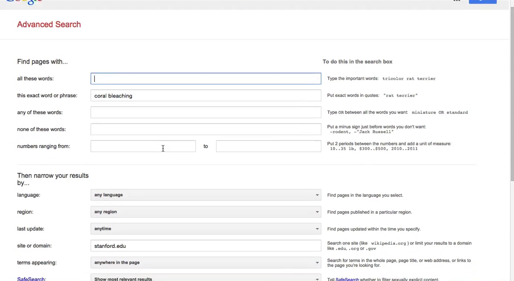

# 3.5 Расширенный поиск и *intext:*

На данный момент мы узнали о нескольких операторах, позволяющих сделать ваш поиск точным и эффективным - __filetype:__, __site:__, __OR__ и кавычки. Сегодня я расскажу еще об одном. Оператором __intext:__ я пользуюсь нечасто, но в определенные моменты он как нельзя кстати. В это уроке я покажу как пользоваться этим оператором, а после расскажу о странице расширенного поиска.

## Оператор *intext:*

Оператор __intext:__ полезен когда вы хотите указать текст, который должен присутствовать в тексте страницы. Вот пример: __site:stanford.edu "coral bleaching" intext:geophysics__ (site:stanford.edu "обесцвечивание кораллов" intext:геофизика). Здесь *site:stanford.edu* - ограничение по сайту, *"coral bleaching"* - поиск фразы, и в конце оператор *intext:* с аргументом *geophysics*. Таким запросом я хочу найти страницы с сайта Стенфорда, которые содержат фразу "coral bleaching", но также содержат термин "geophysics". Почему именно так? Разве простого перечисления терминов недостаточно? Ответ - "нет". Не всегда. Иногда вы ищите, скажем, __слово1 слово2 слово3__ и когда смотрите на страницу не можете найти, например, __слово3__. Это может произойти потому, что страница имеет высокий рейтинг только по словам 1 и 2, и *слово3* будет отброшено. Оператор __intext:__ заставляет учитывать наличие слова в тексте.

Давайте покажу вживую. Ищем __site:stanford.edu "coral bleaching" intext:geophysics__. Мы получили 164 результата и, как видите, самый первый результат содержит слово "geophysics" в отрывке текста. Второй результат не содержит этого слова в отрывке, но не забывайте, что этот отрывок - это как бы самая релевантная выжимка страницы. Если открыть страницу полностью, оно будет там, поверьте мне. Это подводит нас к интересному моменту - иногда, при использовании __intext:__, может показаться, что искомого слова нет на странице, но если просмотреть несколько страниц или разделов, оно там будет. Помните об этом.

Оператор __intext:__ значительно снижает количество результатов: при поиске __site:stanford.edu "coral bleaching" intext:geophysics__ мы получили 164 результата, без него (__site:stanford.edu "coral bleaching"__)  - более 2300.

## Расширенный поиск

Другая полезная штука, на которую я бы хотел обратить ваше внимание - расширенный поиск. Есть два способа попасть на страницу расширенного поиска. Самый простой - нажать на иконку шестеренки в правом верхнем углу. Обратите внимание, её нет на главной странице, она появляется на странице с результатами. Нажав на иконку вы увидите меню с дополнительными опциями, они позволяют настроить поведение поиска, количество результатов, язык и прочее. Нам нужен пункт __Advanced search__ (расширенный поиск).

Нажав на него вы увидите интерфейс расширенного поиска. Он содержит все те операторы, о которых мы говорили до сих пор, на одной удобной странице. Страница открывается с некоторыми заполненными полями, которые были в  запросе (в нашем случае - фраза "coral bleaching" и сайт "stanford.edu").

Здесь доступны все операторы, которые мы изучили. Также тут  присутствуют другие операторы, мы познакомимся с ними в будущих уроках. Например, можно отфильтровать результаты по положению слова на странице - на самой странице, в заголовке, в адресе и т.п. Или отфильтровать по лицензии на использование (Creative Commons и другие).

Другой способ попасть на страницу расширенного поиска - вбить запрос __google advanced search__. Нужная ссылка будет первым результатом. Или сразу перейти на [https://google.com/advanced_search](). Можно добавить эту страницу в закладки, например.

*Примечание переводчика:*

*На момент перевода этих уроков (март 2018 года), у Google поменялся интерфейс и иконки с шестеренкой больше нет. Вместо неё появилось меню "Настройки" под строкой поиска*

*Также появилась ссылка внизу главной страницы*

