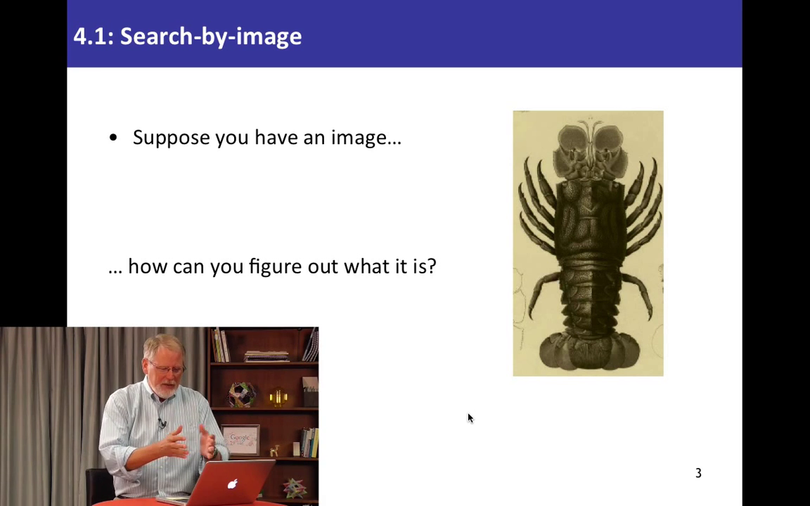
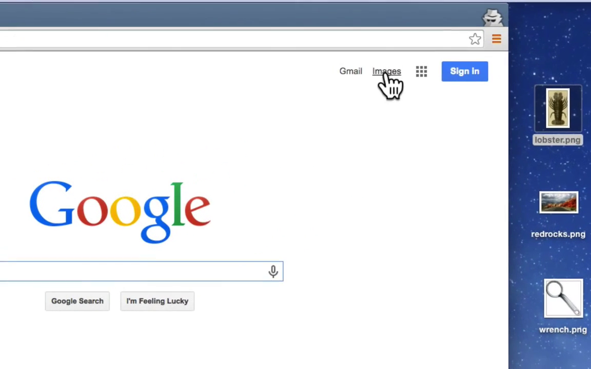
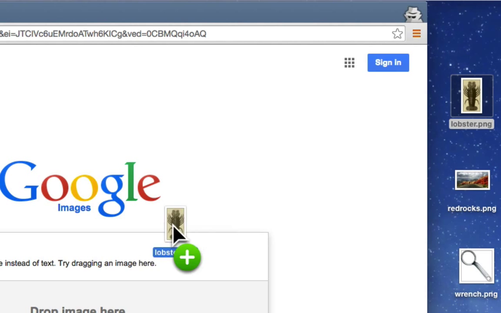
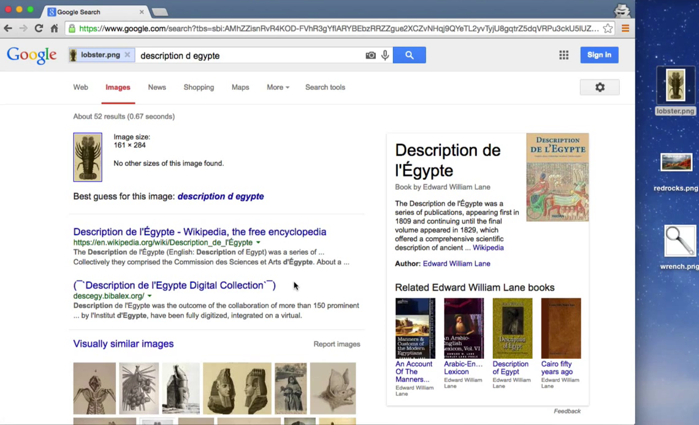
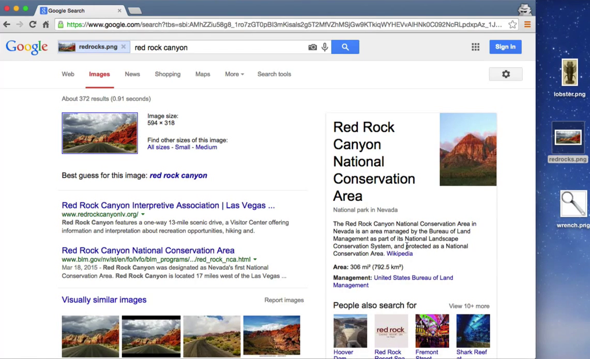
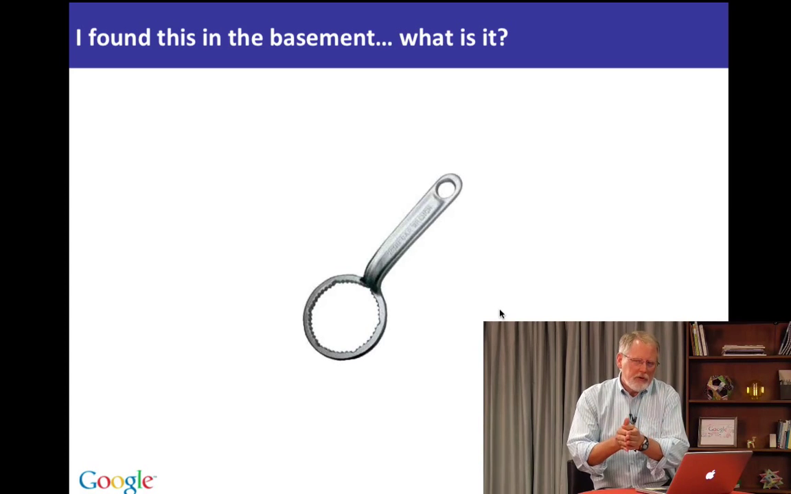
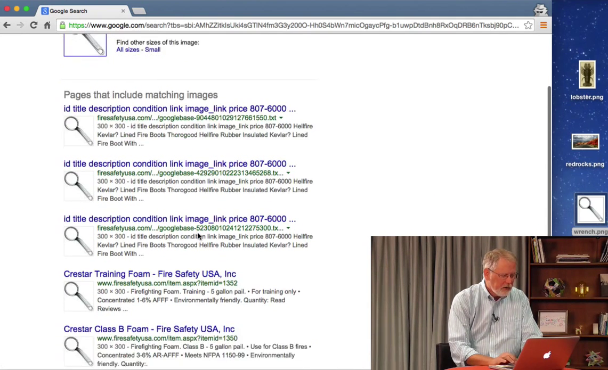

# 4.1 Поиск по картинкам

Это Класс 4 и мы начинаем вторую половину курса "Эффективный поиск с Google". До этого мы изучали базовые функции и инструменты, теперь мы познакомимся с действительно замечательными инструментами. Теперь я хочу удивить вас новыми возможностями.

Давайте поговорим о том, как искать информацию, которую непонятно как искать. Начнем мы с поиска по картинкам.

Поиск по картинкам - это очень простая идея. Мы уже знаем о *поиске картинок*, когда вы набираете несколько слов и Google выдает картинки подходящие под данное вами описание. Теперь мы немножно развернем процесс в обратную сторону - вот у нас есть картинка какого-то лобстера.

Можем ли мы использовать эту картинку, чтобы найти информацию о ней в интернете? Без привлечения слов. Давайте покажу как это работает.

Изначально мы находимся на главной странице Google и нам нужно переключиться на поиск по картинкам нажав на ссылку *Картинки* в правом верхнем углу.

Обратите внимание, в поисковой строке появится иконка с камерой. И теперь могу взять, скажем, картинку лобстера (она лежит у меня на Рабочем столе) и перетащить её на страницу, и таким образом загрузить её в Google.

Затем Google посмотрит на неё и скажет, есть ли похожие картинки в интернете и их источник.

Здесь надо отметить следующее. В строке поиска находится лучшее описание этой картинки, которое смог подобрать Google. В данном случае, мы узнали, что эта картинка с лобстером из книги "Description de l'Egypte". Оказывается есть книга, опубликованная после экспедиции Наполеона в конце 18-го века. Эта книга была опубликована в 1809 году. Таким образом, взяв картинку с лобстером мы смогли прошерстить весь интернет (включая настолько старые книги) и узнать откуда взялась эта картинка. На странице результатов есть ссылка на статью в Википедии, и краткое описание книги справа на странице. Если мы откроем книгу, то увидим, что лобстер там действительно присутствует, вместе другим замечательными изображениями, описывающими Египет того времени.

Хочу обратить ваше внимание вот на что - если перетащить картинку на *главную страницу* Google, то браузер просто откроет её. Сначала надо переключиться на поиск по картинкам, и затем можно будет загрузить картинку для поиска.

Итак, мы смогли узнать, что это за картинка, просто перетащив её на страницу.

Поиск по картинкам также позволяет узнать где была сделана фотография. Вот фотография какого-то красивого места на Земле. Но где оно находится? Сделаем то же самое - перетащим картинку в Гугл, и постараемся узнать, что это за фото.

Мы быстро обнаружим, что это Национальный заповедник "Ред Рок Каньон", недалеко от Лас-Вегаса.

Несколько неожиданно, потому что это не привычная яркая фотография Вегаса, но с помощью поиска по картинкам мы опять смогли найти описание фото и информацию об этом месте.

Поиск по картинкам реально мощная вещь не только потому, что можно узнать откуда картинка или где сделана фотография, но и узнать, что это за предмет, как в случае с этой штуковиной.

Итак, что же это? Какая-то штука, которую я нашел в подвале и сфотографировал на белом фоне. Зачем я это сделал? Я знаю, что поиск по картинкам может искать фотографии вещей и я предполагаю, что в каком-нибудь каталоге найдется что-то похожее. Потому что, возможно, кто-то захочет её купить. Так что я сфотографировал эту железяку на белом фоне, стараясь по мере возможностей сымитировать картинку из каталога.
Давайте загрузим фото, и мы увидим, что, действительно, нашлось множество каталогов.

Просмотрев ссылки мы узнаем, что это ключ для открывания канистры с пенообразователем. Его используют пожарные, чтобы залить всё вокруг пеной.

Мне удалось точно опознать предмет просто сделав фото и покопавшись в каталогах.

Теперь попробуйте сами. Поиск по картинкам действительно впечатляет. Вы будете удивлены, увидев сколько всего можно узнать с его помощью.
