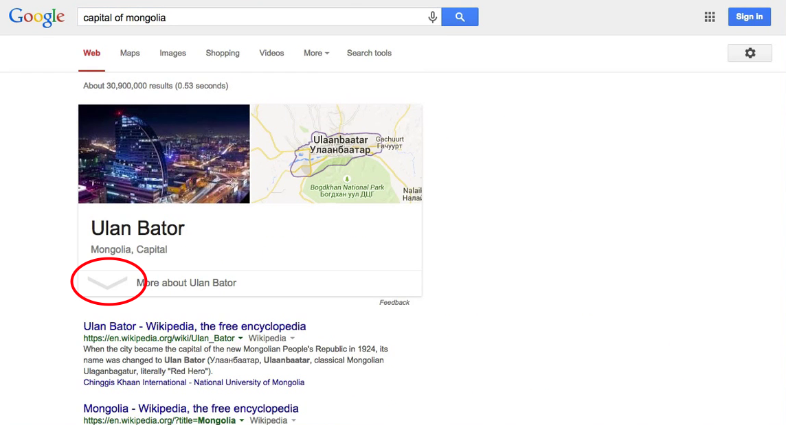
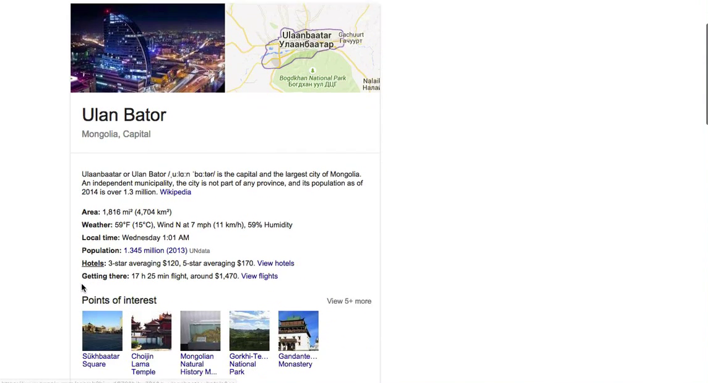
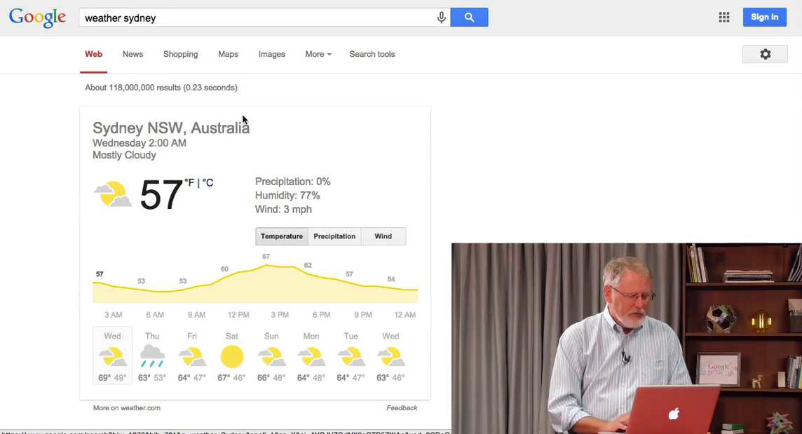
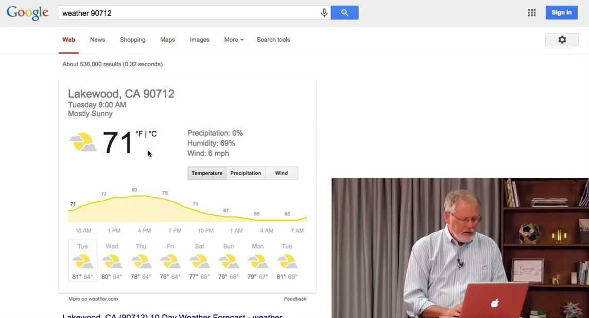
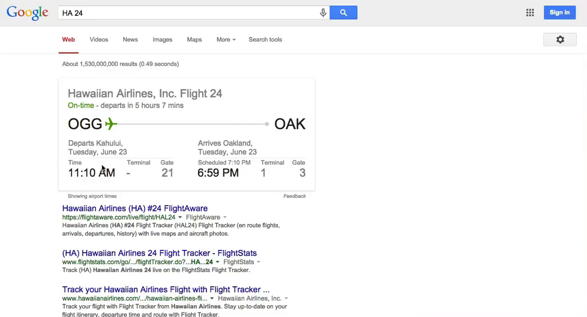
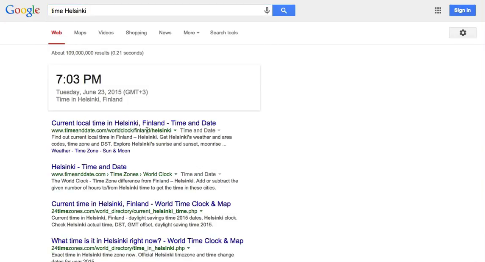
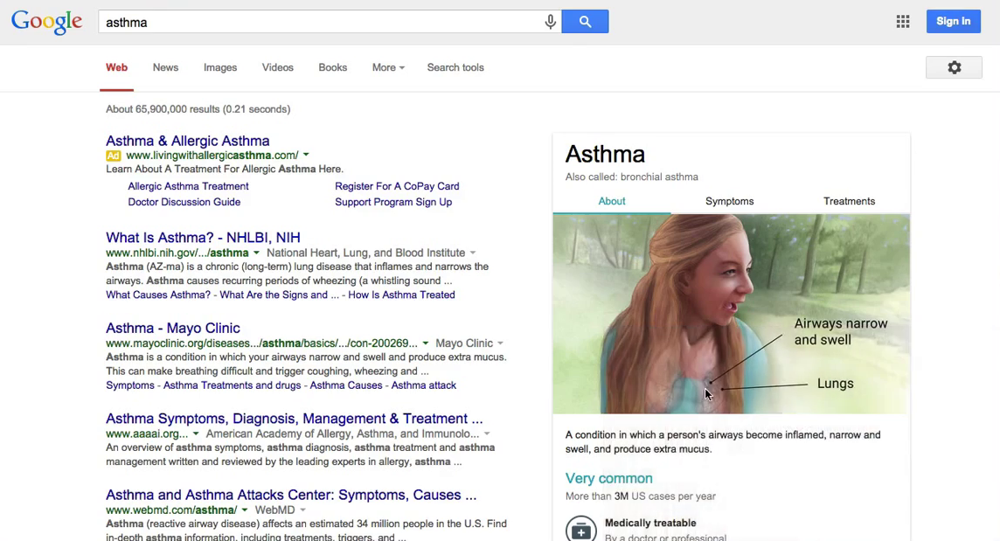
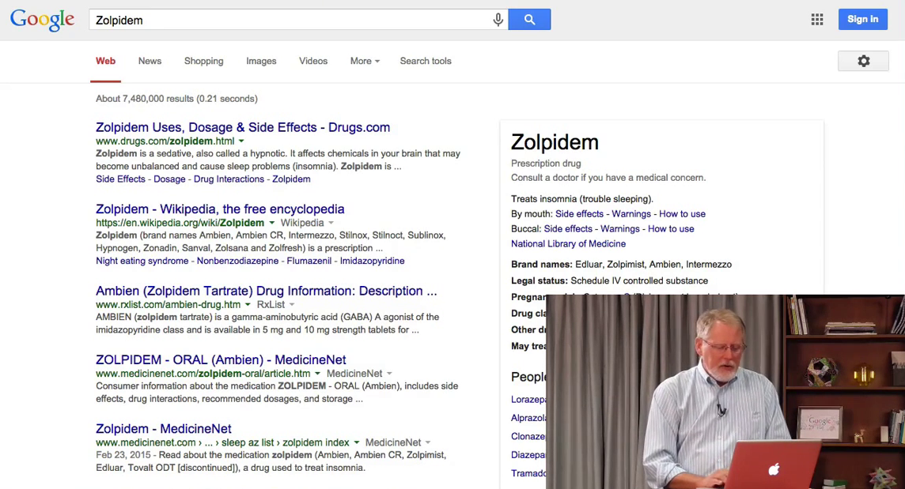

# 4.2 Быстрые результаты

В этом уроке мы узнаем о быстрых результатах, т.е. о кратких запросах, которые можно использовать, чтобы найти инфу очень-очень быстро. По факту, я покажу некоторые шаблоны запросов, которые позволят узнать погоду или медицинскую информацию и т.п.

Существует куча фактов, которых Google можно просто спросить. Например, как называется столица Монголии. Или погода по названию города или почтовому индексу. Давайте попробуем.

Итак, __capital of Mongolia__ (столица Монголии)

Как видите, это Улан-Батор. Обратите внимание на указывающую вниз стрелку. Каждый раз, когда вы видите такую стрелку, значит информации больше, чем показано. Нажмите на нее и узнаете подробности.

Термины Area (площадь), Wheater (погода), Local Time (местное время) и т.п. - это ссылки. Нажав на них, вы получите еще больше информацию.

Еще один частый запрос - погода. Давайте наберем, например __weather Syndey__ (погода Сидней). И вот ответ - прогноз погоды для Синднея. Можно посмотреть температуру в градусах Цельсия или Фаренгейта. Или узнать вероятность осадков и силу ветра.

Пример погоды по индексу - наберем __weather 90712__, я знаю, что это где-то в Лос-Анжелесе.

В добавок к погоде, легко узнать кучу информации, завязанной на фактах. Например, есть тонна данных об авиаперелетах. Я могу набрать __HA 24__ (Hawaii Airlines, Гавайские Авиалинии, рейс 24) и быстро узнать, что это рейс из Кахулуи в Оклэнд. Вылетает через несколько часов.

Еще один запрос - время. Пишем __time Helsinki__ (время Хельсинки). Там 7:03 вечера.

Подобным образом можно попробовать искать медицинские запросы. Что такое астма? Просто пишем __asthma__. На странице результатов справа, видим панель информации. Обратите внимание, в панели есть несколько вкладок - можно просмотреть список симптомов, или узнать о лечении и т.п. Многие медицинские симптомы, болезни и прочее имеют подробное описание в панели информации.

Еще запрос на медицинскую тему. Предположим, мы хотим узнать больше о лекарстве Zolpidem. Набрав название получим информацию о препарате - другие названия на рынке, назначение, побочные эффекты и т.п.

Все эти короткие запросы - лишь способ быстро получить информацию на интересующую тему. Полный список всех запросов (а их много, я показал лишь несколько) находится по запросу __google search features__.
