# 4.3 Конвертация и калькулятор

В этом уроке мы узнаем забавные и полезные трюки с конвертацией и калькулятором. Это очень полезные инструменты. Как и в прошлом уроке, я покажу несколько шаблонов запросов.

## Конвертация

Базовый шаблон выглядит так: __*number units* in *units*__ (*число единиц* в *единицах*). Давайте покажу на примерах.

Хочу узнать 212 градусов Фаренгейта в градусах Цельсия. Если вы знакомы со шкалой Фаренгейта, то знаете, что 212 это такое особое число. Пишем - __212F in С__.

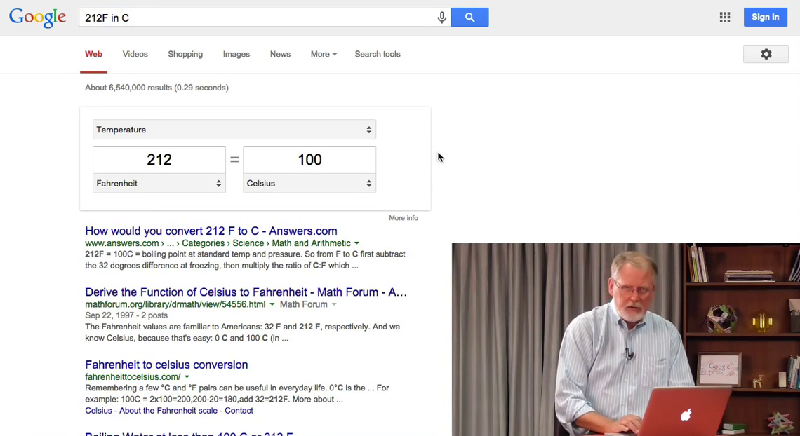

Как видите 212 по Фаренгейту это 100 градусов Цельсия. Результат выводится в удобном виджете, где мы можем менять числа и единицы измерения, например выставить Кельвины. Давайте введем 98,6 °F. Результат - 37 °С, температура человеческого тела.

Помимо температурных единиц мы можем конвертировать длину, объем и прочее. Пробуем - __400 yards in miles__ (400 ярдов в милях). Это 0.227273 мили.

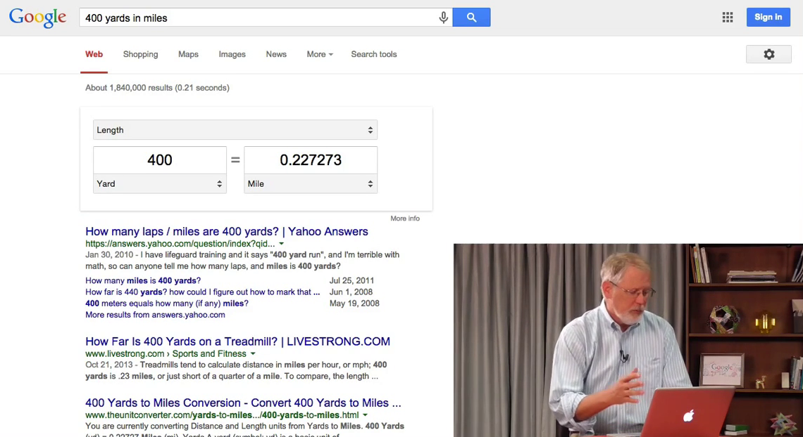

Но большинство захотят перевести ярды в километры. Можно поменять единицы в виджете, а можно изменить сам запрос (__400 yards in km__), результат будет один и тот же.

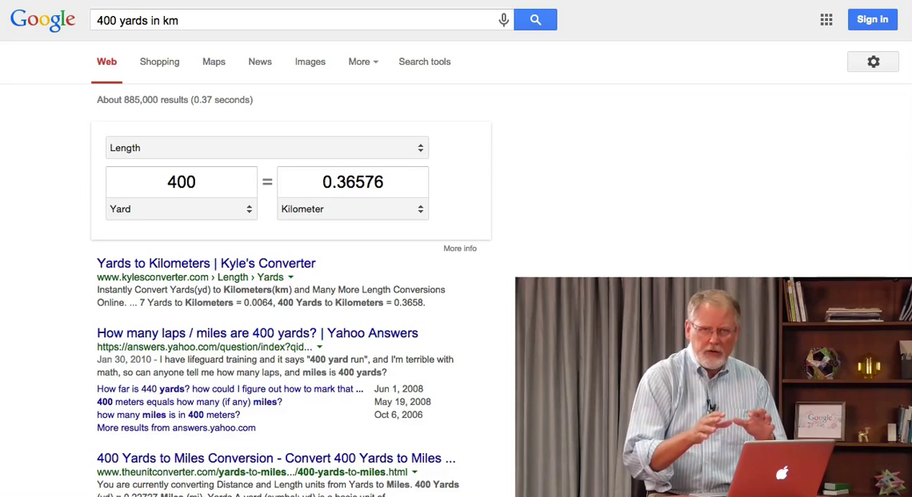

Так же удобно переводить одни единицы объема в другие, т.к. часто это довольно сложно, особенно в английской системе мер, которая используется в США. Честно, никогда не помню, сколько это - [бушель](https://ru.wikipedia.org/wiki/%D0%91%D1%83%D1%88%D0%B5%D0%BB%D1%8C). Пишем - __32 bushels in quarts__ (32 бушеля в квартах).

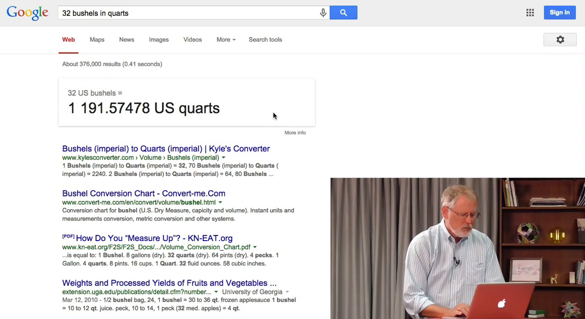

Это 1191.57 американской кварты. Довольно бесполезная информация в остальном мире. Тогда попробуем __32 bushels in liters__ (32 бушеля в литрах).

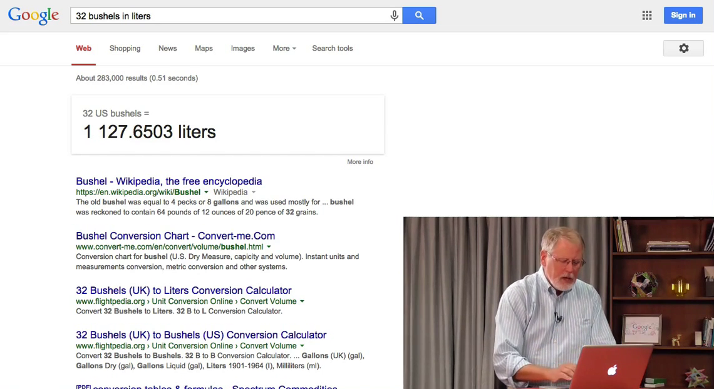

Можем посмотреть в галлонах или баррелях, но вы уже уловили - *число единиц* в *единицах*. Весьма полезно, когда попадаются единицы измерений, которыми вы редко пользуетесь. Давайте попробуем такое - __2 inches in Angstroms__ (2 дюйма в [ангстремах](https://ru.wikipedia.org/wiki/%D0%90%D0%BD%D0%B3%D1%81%D1%82%D1%80%D0%B5%D0%BC)).

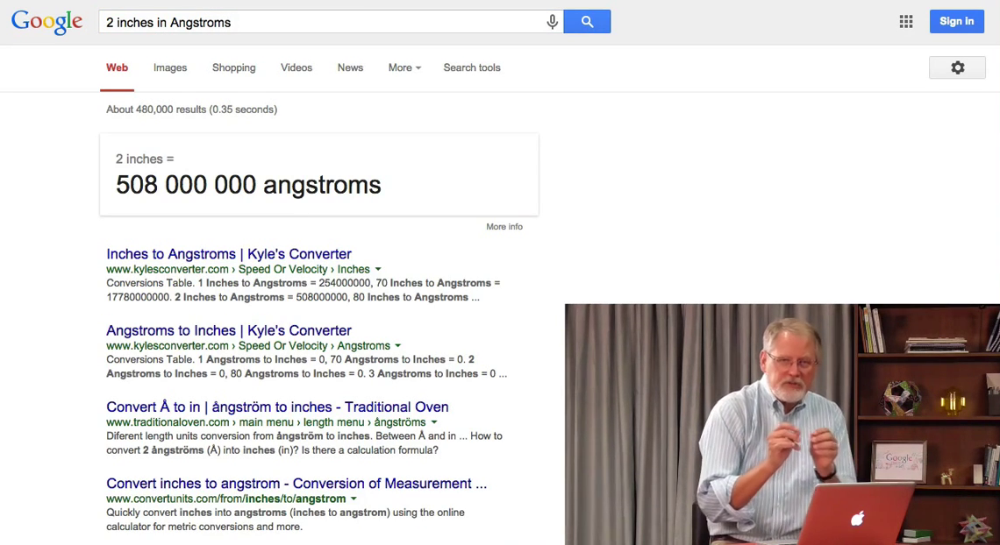

Ангстрем - это очень крохотная единица, обычно используется для измерения расстояний в кремниевых чипах.

Обратите внимание, если вы хотите провести заведомо неверную конвертацию, скажем, сантиметры в миллилитры, т.е. длину в объем, то в ответ получите ссылки на страницы, где упоминаются оба этих слова.

## Калькулятор

Мы можем проводить несложные вычисления в строке поиска. Запрос __1+2__ выведет ответ "3". Но кроме ответа мы получаем доступ к калькулятору.

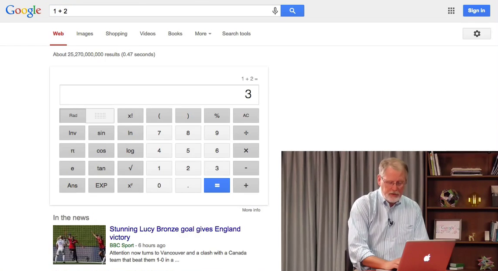

Если в строку поиска ввести что-то вроде __y = sin(x)__, то Google выведет график этой функции.

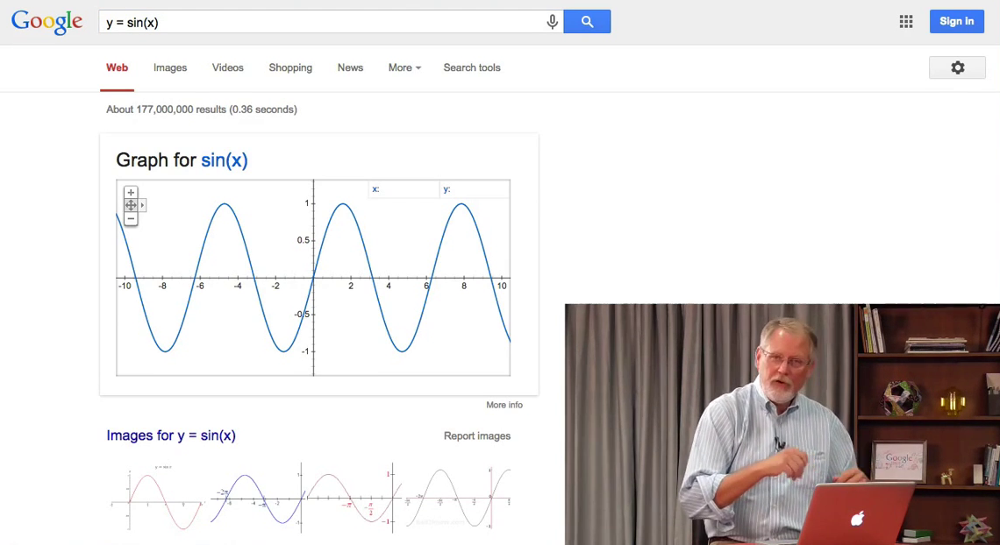

Если изменить запрос на __y = sin(x), y = cos(x)__, то увидите сразу оба графика - синий и красный соответственно.

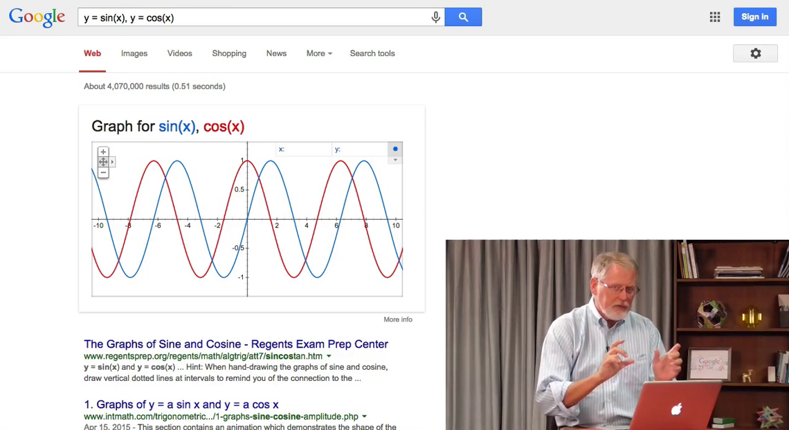

Графики работают и в более сложных случаях. Набрав __z = cos(x) + cos(y)__ мы получим 3D график, т.к. ввели уравнение с тремя переменными.

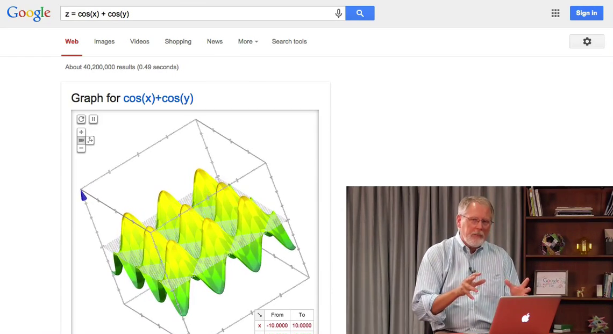

А вот вам "пасхалочка": __number of horns on a unicorn__ (число рогов единорога). Конечно, это "1".

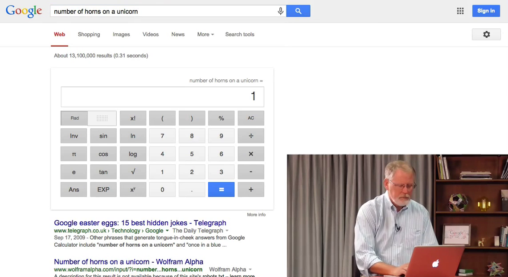

Чтобы было еще интереснее добавим сюда __the loneliest number__ (самое одинокое число)

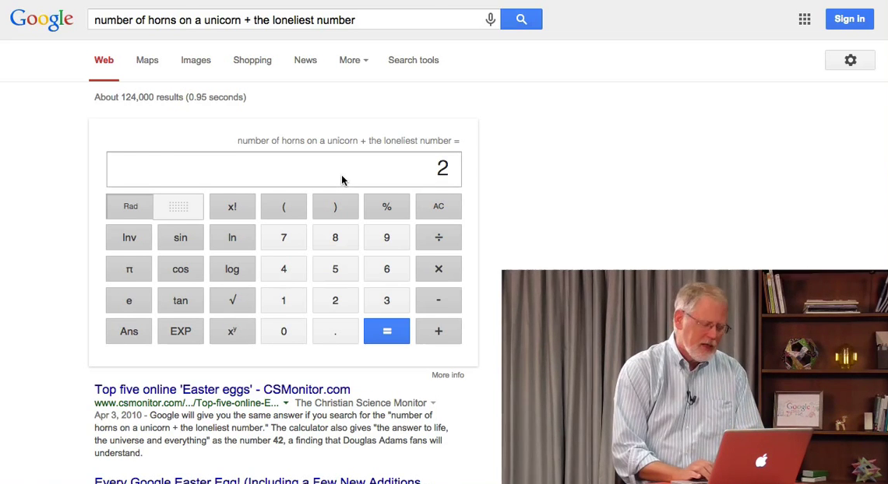

1 + 1 = 2.

Вот, просто забавная штука.

Смысл всех этих калькуляторов и конвертеров - дать вам возможно узнать ответ очень быстро, не отвлекаясь на рядом лежащий калькулятор.
