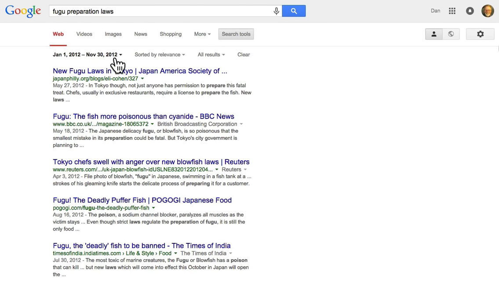

# 4.4 Ограничение диапазона дат

В этом уроке мы уделим внимание панели поиска, и я расскажу о сортировке результатов по дате.

Вы можете набрать запрос вроде __fugu preparation laws__ (приготовление фугу законы). Фугу - это рыба, которую надо готовить особым образом, её используют в японской кухне. Вот мы получили обычные результаты поиска.

Я хочу обратить ваше внимание на ссылки, находящиеся под строкой поиска. Нажав ссылку "Видео" можно посмотреть видео по теме, "Картинки", "Новости" и т.д. Нас интересуют "Search tools" (инструменты поиска). Щелчок на ней открывает дополнительную панель, где можно изменить, например, моё местоположение. Но нам важнее самая первая ссылка - "Any time" (за всё время). Она позволяет отфильтровать результаты по времени, когда страница была опубликована в сети. Можно просмотреть результаты за последний час, за сутки, неделю и т.д.

Теперь я хочу показать вам пункт "Custom range..." (за период...). Я знаю, что законы Японии, касающиеся приготовления фугу, как-то поменялись в 2012 году. Введу диапазон с 1 января по 30 ноября 2012 года. Можно набрать руками или натыкать мышкой в календаре.

Получим страницы за указанный период (он отображается наверху).

Эта штука бывает полезна, когда хочется узнать что писали люди о каком-то событии в определенном году. Например, когда выбрали место проведения Кубка мира 2022, что обсуждали люди? Как бы нам это узнать? Давайте напишем __world cup 2022__ и выберем 2010-2012 годы. Где-то в этих годах было определено место проведения Кубка. Мы получим кучу станиц, которые были опубликованы в то время.

Я могу переключиться на вкладку Новости и посмотреть все новости опубликованные в тот период.

Давайте выполним еще один поиск, на этот раз поближе ко мне. Я наберу __14th congressional district california election__ (14й избирательный округ калифорния выборы). Скажем, я хочу узнать больше о выборах 2011 года. Укажу диапазон с 1 января по 31 декабря 2011 года и получу все отчеты и репортажи за тот год.

Хочу показать еще пару штук. Помните операторы *OR* и *intext:* из предыдущих уроков? Изменим запрос на __14th congressional district california OR ca election intext:eshoo__. Получим все результаты, касающиеся выборов 2011 года, где на странице присутствует фамилия Eshoo (это один из кандидатов).

Еще одна полезная штука - вы видите, что сейчас результаты сортируются по релевантности. Я выберу "Sorted by date" (сортировать по дате), это изменить порядок вывода результатов. Т.е. самые свежие будут выводиться первыми: 29 декабря 2011, 27 декабря, 22 декабря и т.д.

Фильтрация результатов по дате - очень простая и полезная функция. Заметьте, что какой-нибудь документ может быть написан гораздо раньше, например в 18 веке, но если он опубликован в 2012 году, то именно этот год будет связан с документом.
