# 4.5 Поиск и перевод

Этот урок посвящен всемирной паутине. В том смысле, что интернет охватывает весь мир, и множество страниц и прочего контента доступно на самых разных языках. Этот урок о том, как искать контент на неродном для вас языке, из стран по всему миру. Google имеет ряд инструментов, которые помогут в этом, вне зависимости от языка и страны.

Предположим, я хочу узнать, что мир думает о событиях в [еврозоне](https://ru.wikipedia.org/wiki/%D0%95%D0%B2%D1%80%D0%BE%D0%B7%D0%BE%D0%BD%D0%B0). Открываем Google и набираем запрос __eurozone__. Один из способов найти информацию на иностранном языке - воспользоваться расширенным поиском Google. В данном случае, он находится в правом верхнем углу за иконкой в виде шестеренки.

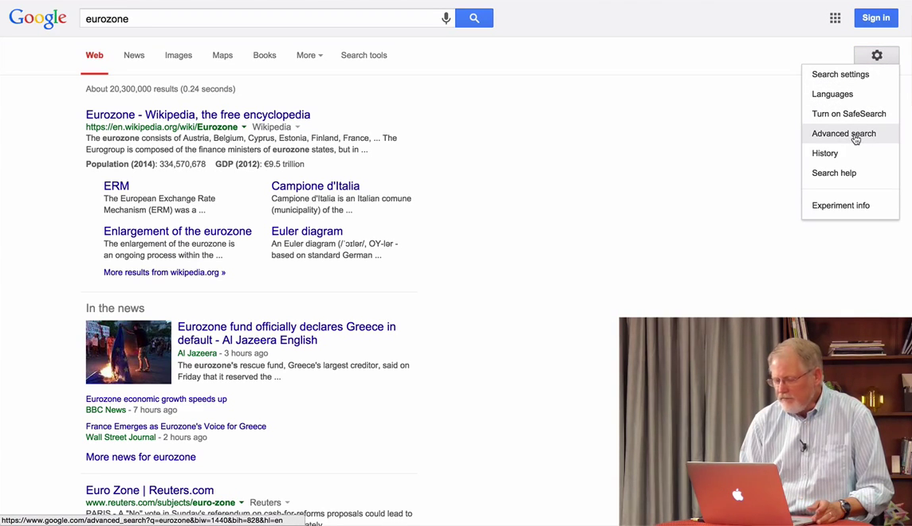

Нажимаю на пункт *advanced search*, и попадаю в интерфейс настроек поиска. Мы хотим ограничить поиск по языку, на котором написан документ или веб страница. Сейчас опция *language* (язык) имеет значение *any language* (на любом языке). Поменяем её, скажем, на испанский. Ниже можно выбрать регион, но сейчас я хочу увидеть результаты на испанском со всего мира, поэтому пока пропустим.

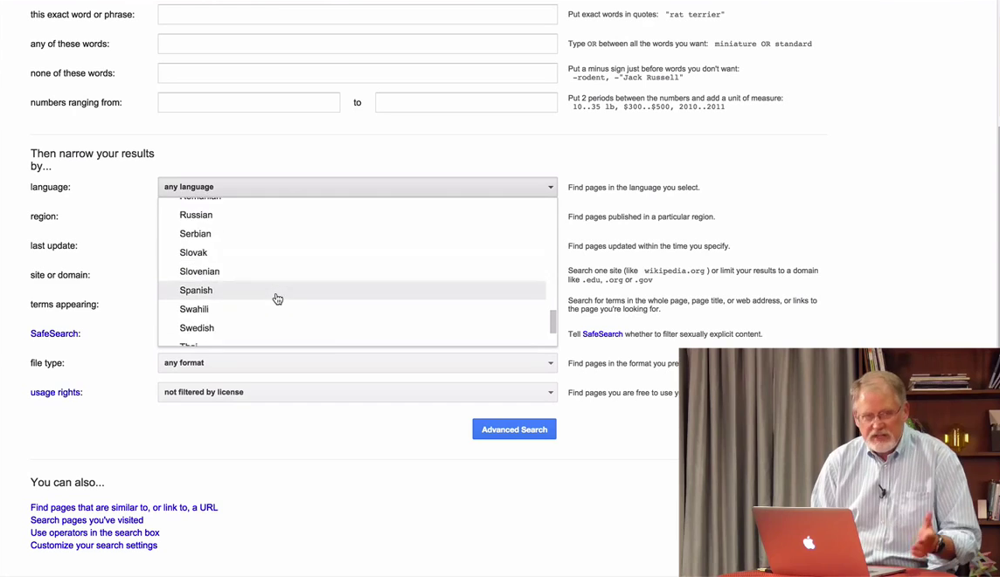

Мы получили кучу результатов и давайте взглянем на самый первый подробнее.

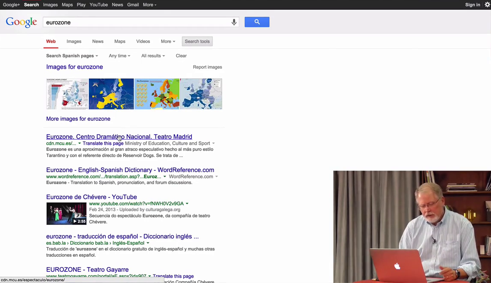

Вот отличная страница с кучей испанского текста, но на самом деле я хочу её перевести. В браузере Google Chrome наверху появляется панель с предложением перевести страницу, когда браузер обнаруживает иностранный язык (родной язык задается в настройках).

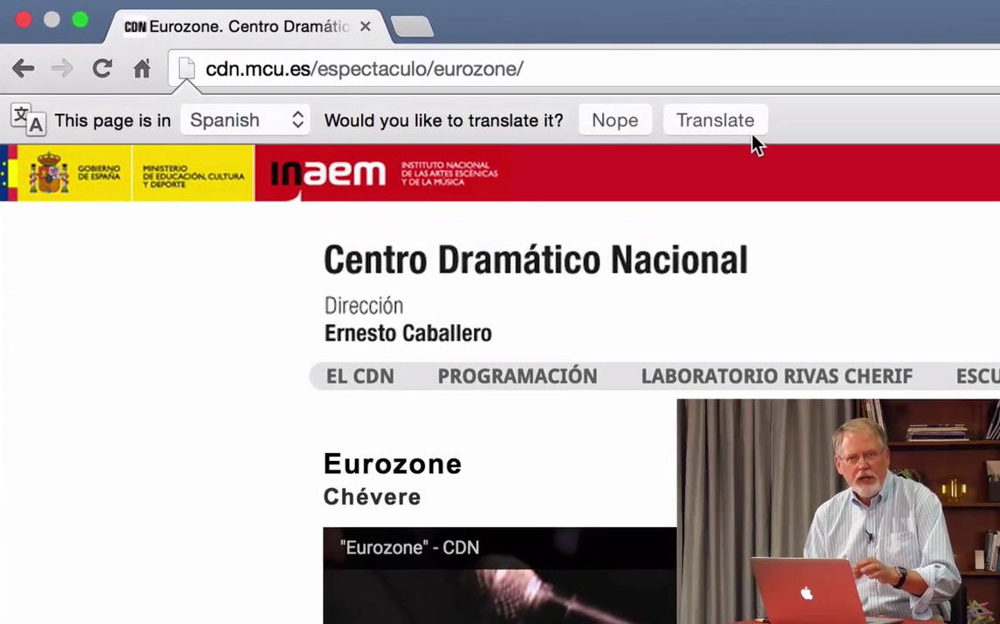

Когда мы нажмем *Translate* (перевести), браузер отправит всю страницу в сервис Google Translate и отобразит переведенную страницу, в моем случае на английском языке.

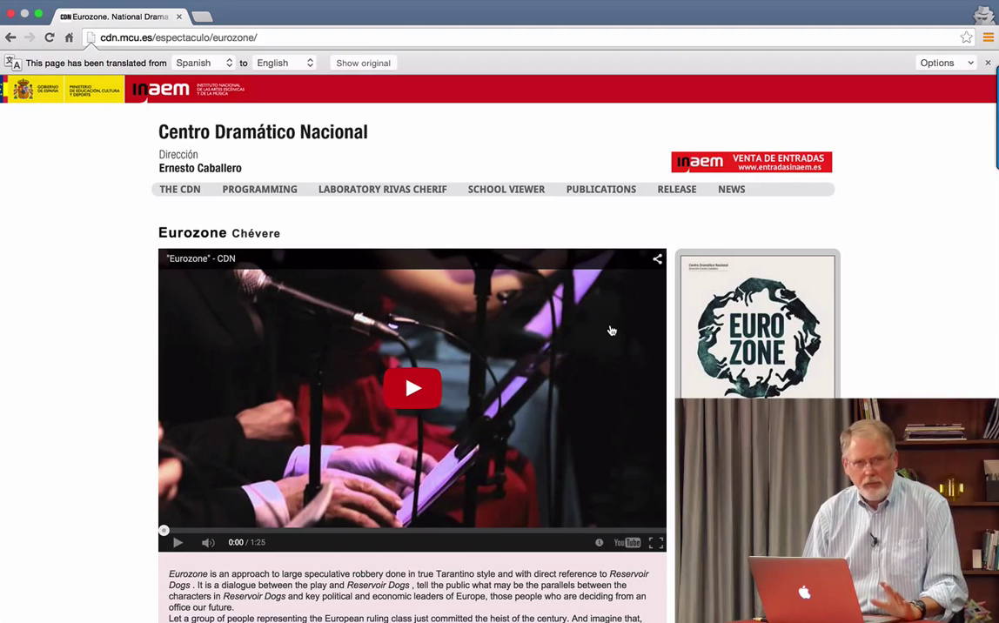

Некоторый текст остался без перевода, потому что на самом деле это картинки и гугл не может выцепить текст для перевода.

При наведении на перевод вы увидите исходный текст. Это бывает полезно, если вы немного владеете другим языком.

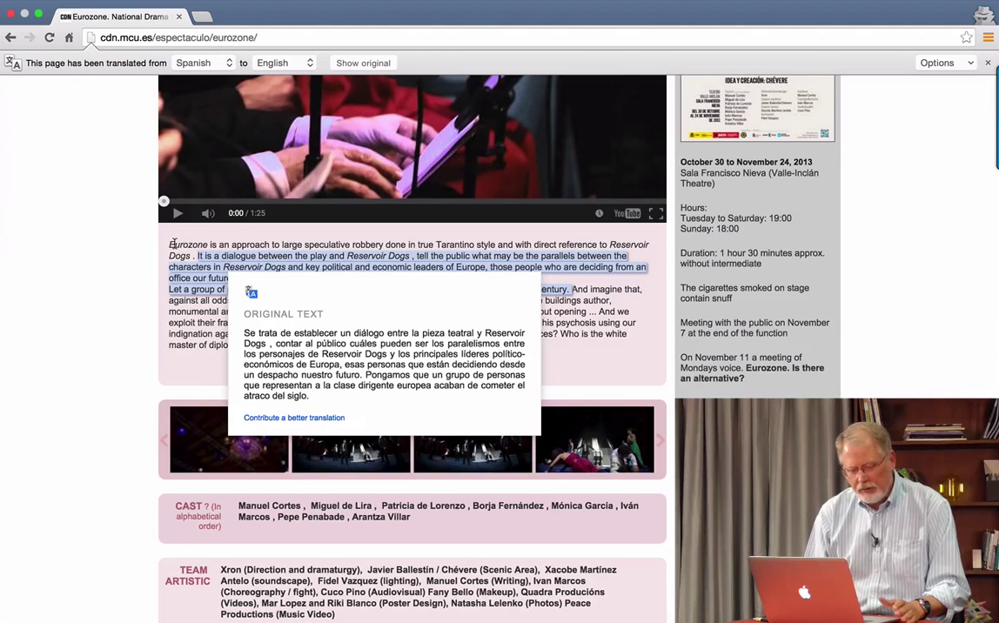

Теперь я хочу узнать что пишут люди о еврозоне на испанском, но не во всем мире, а в какой-то его части. Перейдем в настройки расширенного поиска. Язык оставим испанским, а регион выберем какой-нибудь поближе, например, Мексику. Выберем её из списка.

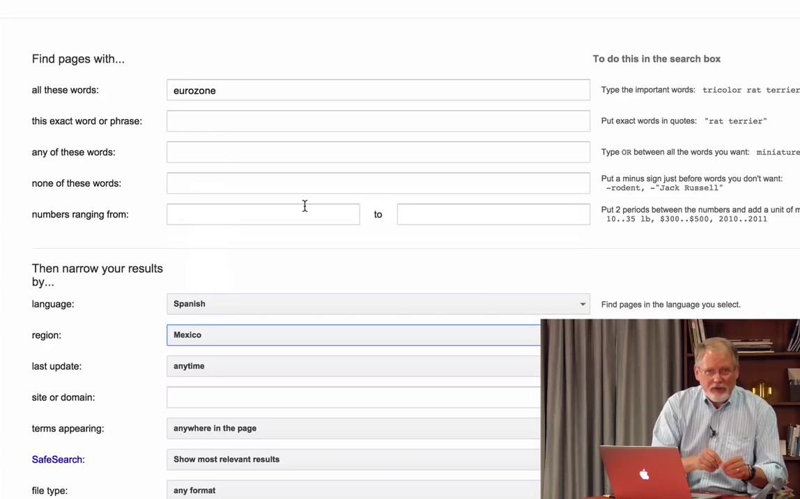

Таким образом мы получим страницы на испанском языке, которые расположены только на мексиканских серверах и содержат термин __eurozone__.

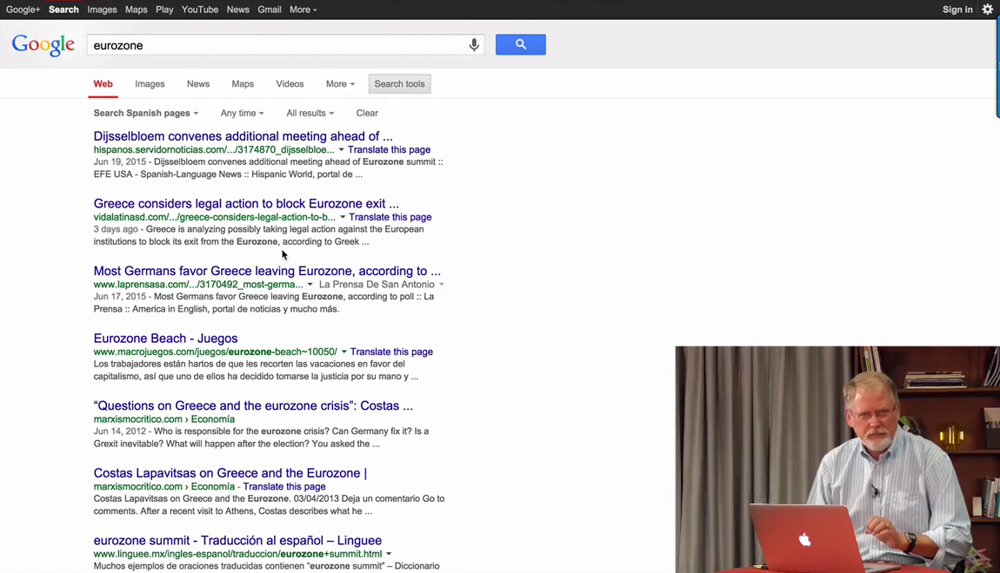

Приведу еще пример. Мы ищем информацию о речных дельфинах (river dolphin). Перейдем в расширенный поиск, выберем португальский язык, я хочу узнать что пишут о речных дельфинах на португальском. И я хочу видеть результаты только из Бразилии.

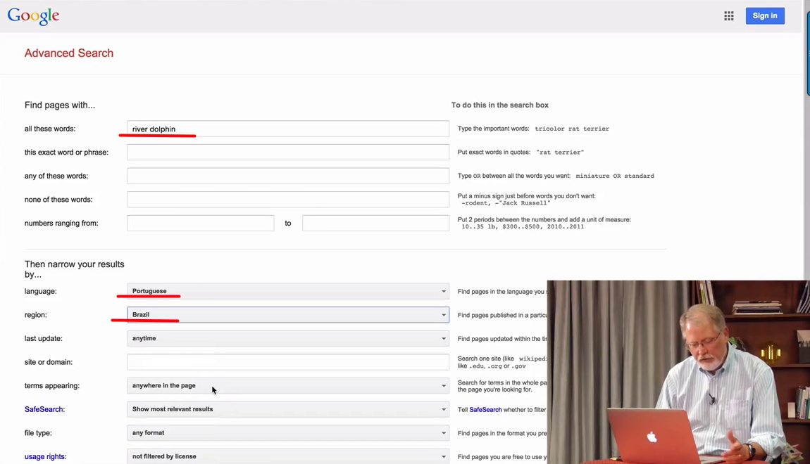

А теперь подумайте, что произошло. Мы ищем английские слова - river dolphin - на страницах на португальском языке в Бразилии. Странное сочетание. Нам следует перевести наш запрос на португальский и тогда выполнить поиск.

В новой вкладке откроем сервис переводов Google ([https://translate.google.com]()). Ведем наш текст "river dolphin" и выберем португальский. Получим результат - *golfinho de rio*.

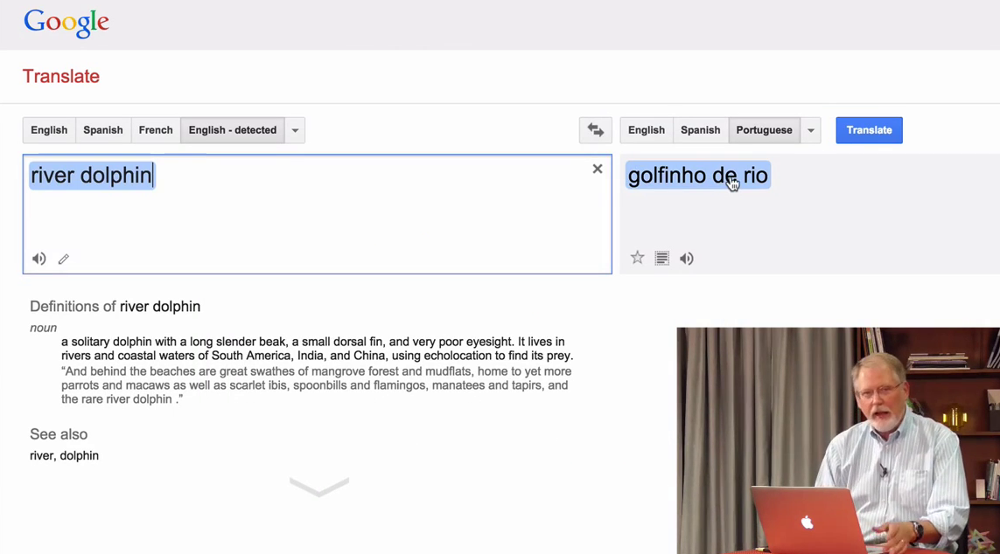

Скопируем текст, вернемся в предыдущую вкладку, выполним поиск и получим отличные результаты.

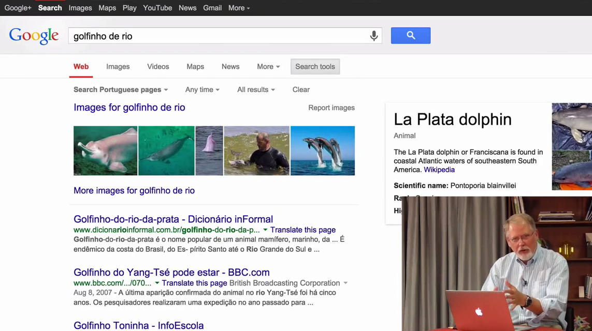

Откроем одну из ссылок, хочу показать как она выглядит. Это научная статья на португальском языке, из Бразилии, которая содержит слова "речные дельфины" на португальском языке. Здорово!

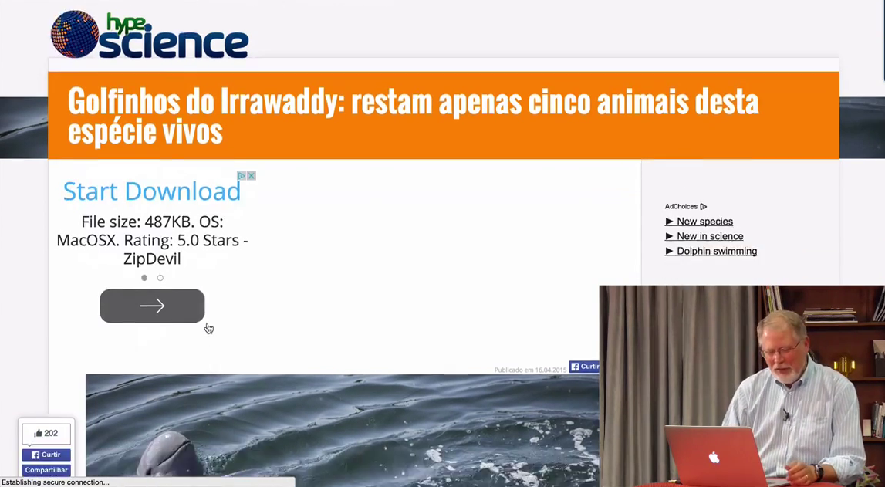

Хочу показать еще одну полезную фичу. Мы уже видели как перевести открытую страницу, но также мы можем перевести страницу прямо на станице результатов поиска. Рядом с адресом страницы есть ссылка *Translate this page* (перевести страницу). Она позволит перевести страницу в один клик.

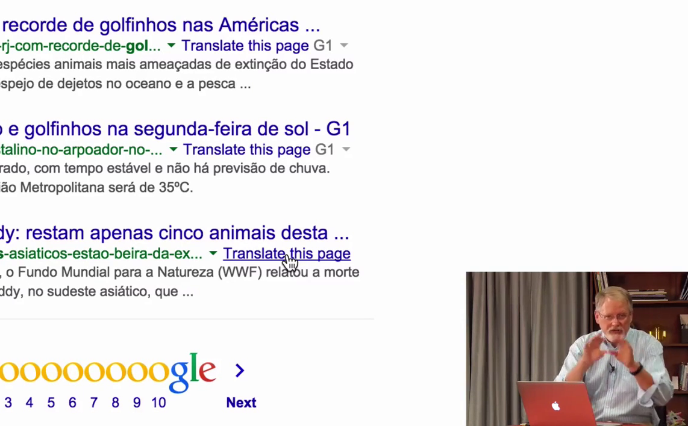

Теперь вернемся в Google Translate. Если вставить в левое поле адрес страницы, которую мы видели ранее, и попросить перевести её на китайский, то в правом поле мы получим новый адрес, открыв который мы увидим страницу на китайском.

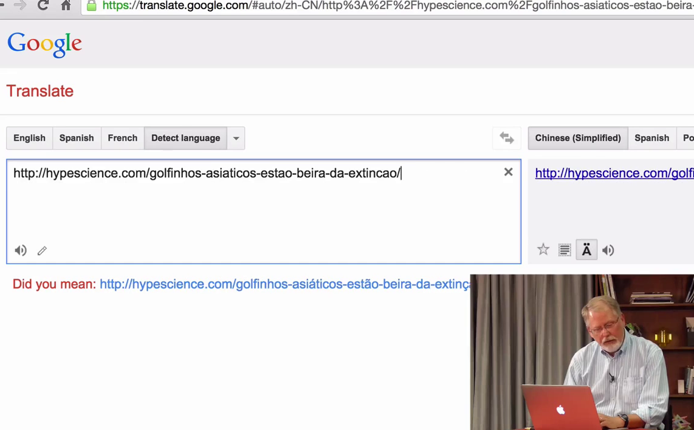

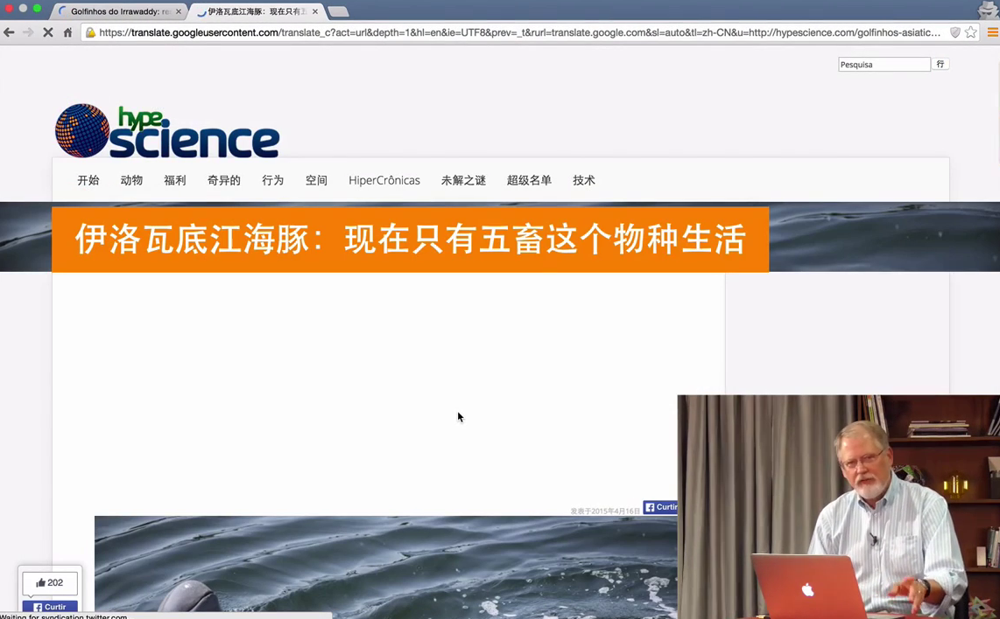
